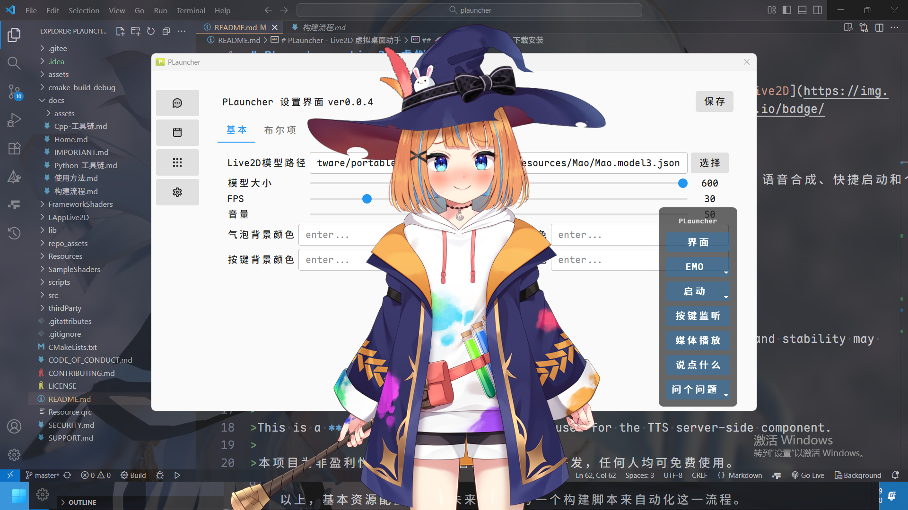
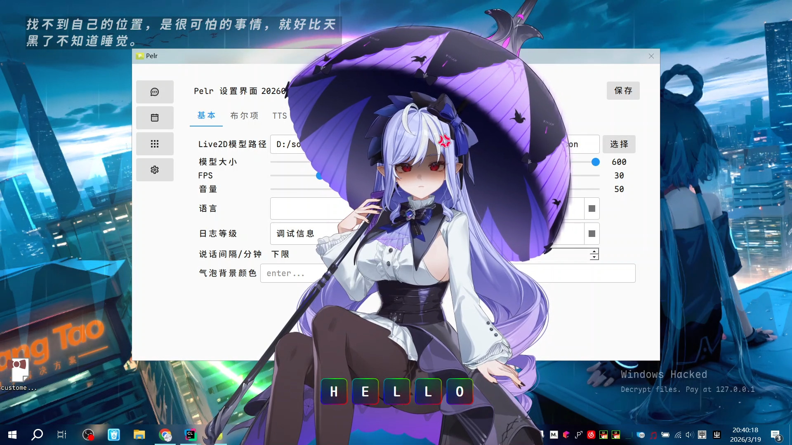

# Pelr - 工具向桌宠


[](https://github.com/csy214-beep/pelr/actions/workflows/sync-to-gitee.yml)


**Pelr** 是一款基于 Live2D 技术的智能桌面虚拟伙伴，集成了 AI 对话、语音合成、快捷启动、TODO功能和个性化桌面伴侣等功能，为您提供沉浸式的桌面体验。

> [!NOTE]
>
>本项目仍处于开发阶段，功能和稳定性可能有所不足，请谨慎使用。
>
>This project is still in the development phase, and its functionality and stability may not be fully optimized. Please
> use with caution.
>
>这是一个 **C++** 项目，Python仅用于 TTS 服务端。
>
>This is a **C++** project; Python is only used for the TTS server-side component.
>
>本项目为非盈利性开源项目，作者出于个人兴趣开发，任何人均可免费使用。
>
>This is a non-profit, open-source project, developed out of personal interest by the author. It is free for anyone to
> use.

## 主要特性

- **Live2D 虚拟角色** - 支持 Live2D 模型 (仅支持 model3.json 格式)，提供生动的桌面伴侣体验
- **智能对话** - 集成 Ollama AI，支持自然语言交互
- **表情动作** - 支持模型（如果模型支持）自带的表情动作，提供丰富的表情切换
- **语音合成** - 内置OpenAI-Edge-TTS、讯飞 TTS 服务，提供高质量的语音反馈
- **TODO功能** - 简单的TODO系统，可以添加事件，并提醒待办
- **启动管理** -
  可视化管理启动应用程序（内置功能，别于系统），启动Windows的任何文件、链接，继承自[QuickTray](https://github.com/Pfolg/QuickTray)
- **键盘监听** - 显示按键状态，继承自[KeyMonitor](https://github.com/Pfolg/KeyMonitor)
- **音乐托盘** - 托盘图标随系统音量转动，继承自[Rotating Rhythm](https://gitee.com/Pfolg/Rotating-Rhythm)
- **天气服务** - OpenWeather 集成，实时获取天气信息
- **高度可定制** - 丰富的设置选项，满足个性化需求

更多功能待开发...

### 尚不支持的功能

> 未来也不一定会支持

- 唇形同步
- 运行系统命令
- 快捷键
- 热加载用户配置

### TODO

> 时间尚不充裕，择机编写

- pmx支持(计划引入：benikabocha/saba)
- 将输出翻译成指定语言后再TTS(可能通过Qt设置，Python实现)
- 多语言支持(低优先级)
- 系统音频提取(重构)，选择一个第三方库(kissfft)
- 摆脱ollama依赖，采用OpenAI兼容的自定义AI接口

### 预览

<details>
<summary>点击预览</summary>
<div style="display: flex; overflow-x: auto; gap: 10px; padding: 10px; background: #f5f5f5; border-radius: 8px;">
  
  
</div>
</details>

## 系统要求

> [!NOTE]
>
>仅供参考

- **操作系统**: Windows 10/11 (仅支持 Windows 平台)
- **处理器**: 双核处理器或更高
- **内存**: 4GB RAM 或更多
- **存储空间**: 至少 500MB 可用空间
- **显卡**: 支持 OpenGL 3.0 及以上
- **Python**: 3.11 (可选的，仅用于 TTS 服务端)

## 快速开始

### 下载安装

1. 前往 [Release 页面](https://github.com/csy214-beep/Pelr/releases) 下载最新版本
2. 解压压缩包到任意目录
3. 运行 `Pelr.exe` 即可启动应用

另外，囿于Gitee的release限制，您可以前往[sourceforge](https://sourceforge.net/projects/pfolg-plauncher/)查看或下载历史版本。

### 更新

推荐只保留`user`文件夹，其余文件删除。

### 首次运行配置

> [!CAUTION]
>
>**请不要上传 `user`文件夹中的任何内容**

1. **设置 Live2D 模型路径** (必需)
    - 在设置 → 基本设置中配置模型路径
    - 支持 model3.json 格式的 Live2D 模型
    - 模型下载：[Booth](https://booth.pm) | [模之屋](https://www.aplaybox.com/)

2. **配置 TTS 服务** (可选)
    - 申请[讯飞开放平台](https://www.xfyun.cn/)账号
    - 在设置 → TTS配置中填写 API 凭证
    - 点击`启动TTS服务端`或手动运行目录下的 `tts_server.exe`

3. **设置 AI 服务** (可选)
    - 选择 OpenAI 兼容的 AI 服务 （将未来支持）

## 项目结构

<details>
<summary>点击查看项目结构</summary>

```txt
Pelr/
├── CMakeLists.txt          # C++ 项目构建配置
├── scripts/                # 脚本文件
│   └── AUCF/               # 已弃用的模块 Archived Unused Cpp Files
├── src/                    # C++ 源代码
│   ├── core/               # 核心组件
│   ├── ai/                 # AI 组件
│   ├── tts/                # TTS 组件
│   ├── keyboard/           # 键盘监听组件
│   ├── model/              # 模型加载组件
│   ├── utils/              # 工具组件
│   ├── translation/        # 翻译组件
│   ├── ui/                 # UI相关
│   └── main.cpp            # 主入口
├── Resources/              # 模型资源文件
├── lib/                    # 第三方库 动态链接
├── LAppLive2D              # Live2D 模型加载库
├── assets/                 # 资源文件
├── repo_assets/            # 仓库相关资源
├── SampleShaders/          # 示例着色器
├── FrameworkShaders/       # 框架着色器
├── thirdParty/             # 第三方库 源码
│   ├── Core/
│   ├── Framework/
│   ├── glew/
│   ├── glfw/
│   └── stb/
├── translations/           # 翻译文件
├── docs/                   # 文档文件
├── LICENSE.md              # 许可证文件
├── README.md               # 项目说明文件
├── SUPPORT.md              # 参与贡献指南
├── SECURITY.md             # 安全说明文件
├── requirements.txt        # Python 依赖清单
└── tts_server/             # Python TTS 服务端
```

</details>

> [!NOTE]
>
> 仓库中不提供的文件请参见[necessaryPartyStructure](docs/necessaryPartyStructure)

## 技术栈

### C++ 核心组件

- **Qt 5.15.2** - 跨平台应用框架
- **OpenGL** - 图形渲染 (GLEW + GLFW)
- **Live2D Cubism** - 2D 动画渲染引擎 (仅支持 model3.json 格式)
- **STB 库** - 图像处理功能

### Python 工具链

- **Python 3.11** - 开发环境
- **PyInstaller** - 应用打包分发
- **PySide6** - Qt6 跨平台 UI 框架
- **websocket-client** - 网络通信
- **openai-edge-tts** - 本地化的、与OpenAI TTS兼容的、采用Edge-TTS的TTS服务

## 开发构建

### 环境准备

1. **安装 Qt 5.15.2** (MingW81_64 版本)
2. **安装 Python 3.11** 和所需依赖:

   ```bash
   pip install -r requirements.txt
   ```

3. **配置 C++ 编译环境** (CMake + MingW)

### 编译步骤

> [!TIP]
>
> ~~可参考[构建流程](docs/构建流程.md)~~
>
> VSCode 构建正在施工中

## 使用指南

> [!CAUTION]
>
>**请不要上传 `user`文件夹中的任何内容**

> [!NOTE]
>
>详细功能说明请参阅 [Wiki](https://github.com/csy214-beep/Pelr/wikis)

### 基本操作

- **主界面导航**: 使用左侧侧边栏切换功能模块
- **聊天功能**: 在聊天界面输入消息或双击角色显示对话框
- **启动项管理**: 管理自定义的启动程序

## 参与贡献

我们欢迎各种形式的贡献！

- [报告 Bug & 提出新特性](https://github.com/csy214-beep/Pelr/issues)
- [编写代码](https://github.com/csy214-beep/Pelr/pulls)
- [提供反馈](https://github.com/csy214-beep/Pelr/issues)
- [问题反馈](https://github.com/csy214-beep/Pelr/issues)
- [项目文档](docs)
- [帮助中心](https://support.github.com)

## 许可证

> [!NOTE]
>
> 本项目基于 [GNU General Public License v3.0](https://gnu.ac.cn/licenses/gpl-3.0.html) 许可证发布。
>
> 详见 [LICENSE](LICENSE.md) 文件。

**注意**: 部分组件使用不同许可证：

- Live2D Cubism SDK 使用[专有许可证](https://www.live2d.com/zh-CHS/sdk/download/native/)
- Qt 框架使用 [LGPL/GPL 许可证](https://www.qt.io/development/download)
- 其他第三方库详见 [第三方库清单](https://github.com/csy214-beep/Pelr/wikis)
- src 文件夹内由本项目开发者编写的部分采用 GPLv3 许可证

## 致谢

[WIKIS-IMPORTANT](https://github.com/csy214-beep/Pelr/wikis/IMPORTANT)

感谢以下项目和社区的支持：

- [Live2D Cubism](https://www.live2d.com/) - 提供出色的 2D 动画技术
- [Qt 框架](https://www.qt.io/) - 强大的跨平台开发框架
- [llama](https://github.com/ggml-org/llama.cpp) - 本地 AI 模型部署
- [openai-edge-tts](https://github.com/travisvn/openai-edge-tts) - 以OpenAI兼容的方式调用EdgeTTS
- 讯飞开放平台 - 高质量的语音合成服务
- 所有贡献者和用户的支持

## 技术支持

- [问题反馈](https://github.com/csy214-beep/Pelr/issues)
- [Wiki 文档](https://github.com/csy214-beep/Pelr/wikis)
- [SUPPORT](SUPPORT.md)
- [Security Policy](SECURITY.md)
