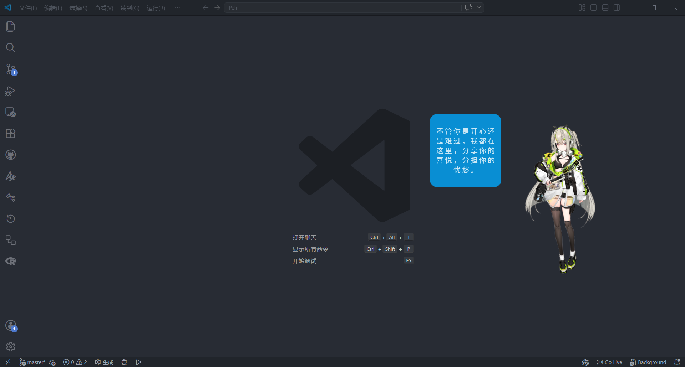
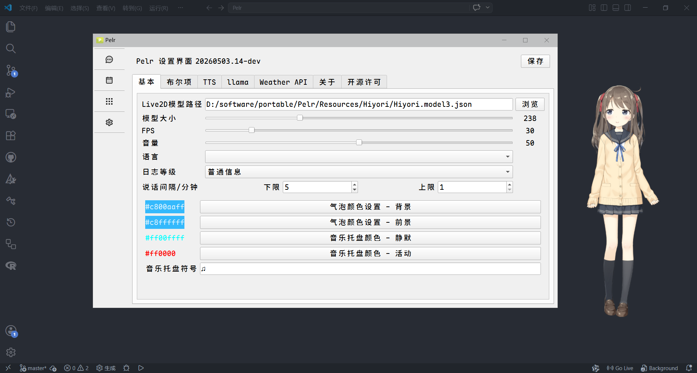
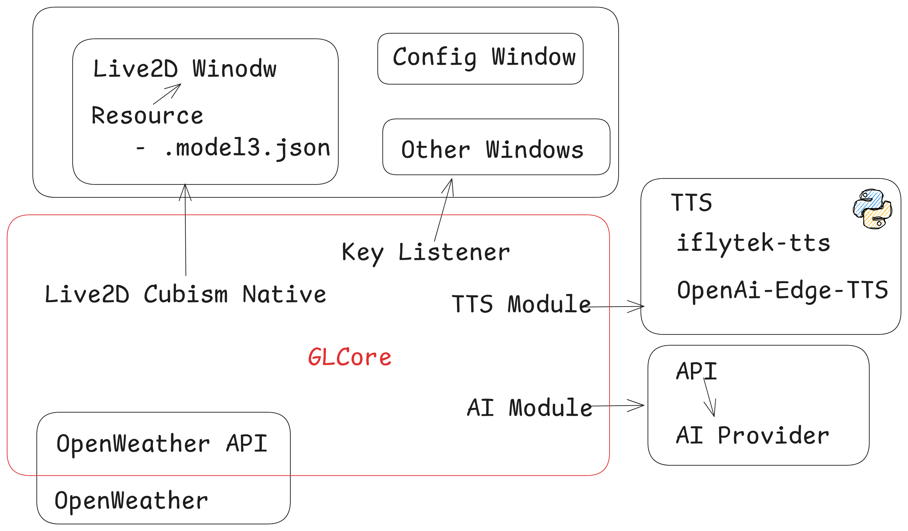

# Pelr - 工具向桌宠

**Pelr** 是一款基于 Live2D 技术的智能桌面虚拟伙伴，集成了 AI 对话、语音合成、快捷启动、TODO功能和个性化桌面伴侣等功能，为您提供沉浸式的桌面体验。

> [!NOTE]
>
> 本项目仍处于开发阶段，功能和稳定性可能有所不足，请谨慎使用。
>
> This project is still in the development phase, and its functionality and stability may not be fully optimized. Please
> use with caution.
>
> 本项目为非盈利性开源项目，作者出于个人兴趣开发，任何人均可免费使用。
>
> This is a non-profit, open-source project, developed out of personal interest by the author. It is free for anyone to use.

## 主要特性

* **Live2D 虚拟角色** - 支持 Live2D 模型 (仅支持 model3.json 格式)，提供生动的桌面伴侣体验
* **智能对话** - 支持 OpenAI 兼容的 AI 服务，支持自然语言交互
* **表情动作** - 支持模型（如果模型支持）自带的表情动作，提供丰富的表情切换
* **语音合成** - 内置OpenAI-Edge-TTS、讯飞 TTS 和 voicevox 服务，提供高质量的语音反馈
* **TODO功能** - 简单的TODO系统，可以添加事件，并提醒待办
* **启动管理** -
  可视化管理启动应用程序（内置功能，别于系统），启动Windows的任何文件、链接，继承自[QuickTray](https://github.com/Pfolg/QuickTray)
* **键盘监听** - 显示按键状态，继承自[KeyMonitor](https://github.com/Pfolg/KeyMonitor)
* **音乐托盘** - 托盘图标随系统音量转动，继承自[Rotating Rhythm](https://gitee.com/Pfolg/Rotating-Rhythm)
* **天气服务** - OpenWeather 集成，实时获取天气信息
* **高度可定制** - 丰富的设置选项，满足个性化需求

更多功能待开发...

### 尚不支持的功能

> 未来也不一定会支持

* 唇形同步
* 运行系统命令
* 快捷键
* 热加载用户配置

### TODO

> 时间尚不充裕，择机编写

* pmx支持(计划引入：benikabocha/saba)
* 多语言支持(低优先级)

### 预览

点击预览

  
  

## 系统要求

> [!NOTE]
>
> 仅供参考

* **操作系统**: Windows 10/11 (仅支持 Windows 平台)
* **处理器**: 双核处理器或更高
* **内存**: 4GB RAM 或更多
* **存储空间**: 至少 500MB 可用空间
* **显卡**: 支持 OpenGL 3.0 及以上
* **Python**: 3.11 (可选的，仅用于 TTS 服务端)

## 快速开始

### 下载安装

重构中，现在、未来不会提供下载。见

### TTS Server

<https://github.com/csy214-beep/Pelr_tts_tr>

根据开源许可规范，不提供该程序的打包版本，请参考该仓库的使用方法。

### 更新

【TODO】

### 首次运行配置

> [!CAUTION]
>
> **请不要在任何平台上传 `user`文件夹中的任何内容**

1. **设置 Live2D 模型路径** (必需)
   * 在设置 → 基本设置中配置模型路径
   * 支持 model3.json 格式的 Live2D 模型
   * 模型下载：[Booth](https://booth.pm) | [模之屋](https://www.aplaybox.com/)

2. **配置 TTS 服务** (可选)
   > 推荐使用免费简单的OpenAI-Edge-TTS，无需配置

   * 申请[讯飞开放平台](https://www.xfyun.cn/)账号
   * 在设置 → TTS配置中填写 API 凭证
   * 根据需要自行启动 TTS 服务（Python <https://github.com/csy214-beep/Pelr_tts_tr>）

3. **设置 AI 服务** (可选)
   * 选择 OpenAI 兼容的 AI 服务

## 项目结构

[项目结构文档](docs/dev-structure.md)

项目文件结构：<https://pg25-lsae.eu.org/demos/SnapshotOfPelr/demo>

## 技术栈

[NOTICE](NOTICE)

### C++ 核心组件

* **Qt 5.15.2** - 跨平台应用框架
* **OpenGL** - 图形渲染 (GLEW + GLFW)
* **Live2D Cubism** - 2D 动画渲染引擎 (仅支持 model3.json 格式)
* **STB 库** - 图像处理功能
* **voicevox** - VOICEVOX 的核心 ，一款免费、中等质量的TTS
* **kissfft** - 实时频谱分析与音频检测

### Python 工具链

<https://github.com/csy214-beep/Pelr_tts_tr/blob/main/requirements.txt>

## 开发构建

> [!TIP]
>
> [简要开发指南](docs/dev-dev.md)

## 使用指南

> [!CAUTION]
>
> **请不要在任何平台上传 `user`文件夹中的任何内容**

> [!NOTE]
>
> 详细功能说明请参阅 [docs](docs/index.md)

### 基本操作

* **主界面导航**: 使用左侧侧边栏切换功能模块
* **聊天功能**: 在聊天界面输入消息或双击角色显示对话框
* **启动项管理**: 管理自定义的启动程序

## 参与贡献

我们欢迎各种形式的贡献！

* [报告 Bug & 提出新特性](https://github.com/csy214-beep/Pelr/issues)
* [编写代码](https://github.com/csy214-beep/Pelr/pulls)
* [提供反馈](https://github.com/csy214-beep/Pelr/issues)
* [问题反馈](https://github.com/csy214-beep/Pelr/issues)
* [项目文档](docs)
* [帮助中心](https://support.github.com)

## 许可证

> [!NOTE]
>
> 本项目基于 MIT 许可证发布。

**注意**: 部分组件使用不同许可证：

* Live2D Cubism SDK 使用[专有许可证](https://www.live2d.com/zh-CHS/sdk/download/native/)
* Qt 框架使用 [LGPL/GPL 许可证](https://www.qt.io/development/download)
* 其他第三方库详见 [NOTICE](NOTICE)
* src 文件夹内由本项目开发者编写的部分采用 MIT 许可证

> [!CAUTION]
>
> ### 重要法律与合规声明
>
> **本项目不含Live2D Cubism Core**。根据Live2D专有软件许可协议，`Cubism Core` 禁止公开分发。使用者**必须**：
>
> 1. 从 [Live2D官网](https://www.live2d.com/zh-CHS/sdk/download/native/) 自行下载SDK。
> 2. 提取对应平台的 `Core` 目录，放置到项目指定位置。【TODO】
> 3. 确保自己的使用行为（尤其是商业及可扩展性应用）符合Live2D许可协议。
>
> **Pelr** 的性质属于 **“可扩展性应用程序”** ，若由您自行编译后分发，**您**需自行承担获取Live2D出版许可的全部责任。
>
> 本项目提供的 Live2D 相关代码遵循其 **开放软件许可协议**。
> src目录下的代码遵循 MIT 许可。

## 致谢

本项目基于以下出色的第三方库和服务构建，特此致谢：

* [Live2D Cubism](https://www.live2d.com/) - 提供 Cubism Native Framework 与 Cubism Core，实现生动的 2D 动画表现
* [Qt 框架](https://www.qt.io/) - 跨平台 C++ 开发框架
* [GLEW](http://glew.sourceforge.net/) - OpenGL 扩展加载库
* [GLFW](https://www.glfw.org/) - 用于创建窗口和处理 OpenGL 上下文的轻量库
* [kissfft](https://github.com/mborgerding/kissfft) - 快速傅里叶变换库
* [stb](https://github.com/nothings/stb) - 单头文件图像/音频处理库
* [VOICEVOX CORE](https://github.com/VOICEVOX/voicevox_core) - 免费中高质量的文本转语音引擎
* [ONNX Runtime](https://onmicrosoft.com/) - 跨平台机器学习推理引擎（随 voicevox_core 集成）
* [llama.cpp](https://github.com/ggml-org/llama.cpp) - 本地 AI 模型部署
* [openai-edge-tts](https://github.com/travisvn/openai-edge-tts) - OpenAI 兼容的 Edge TTS 接口
* 讯飞开放平台 - 高质量语音合成服务

同时感谢以下社区与项目创始者的贡献：

* [Hiroshiba Kazuyuki](https://github.com/Hiroshiba) - VOICEVOX 创始人
* Live2D Inc. - Cubism 技术提供方
* Qt 公司及 Qt 开源社区
* 所有贡献者和使用者的支持与反馈

## 技术支持

* [问题反馈](https://github.com/csy214-beep/Pelr/issues)
* [文档](docs)
* [SUPPORT](SUPPORT.md)
* [Security Policy](SECURITY.md)
