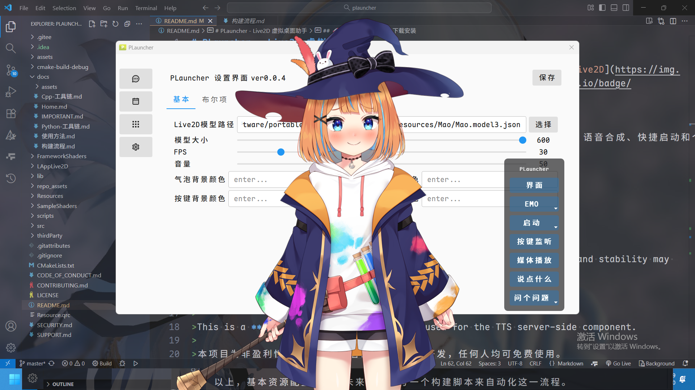

# PLauncher - Live2D 虚拟桌面助手

   


**PLauncher** 是一款基于 Live2D 技术的智能桌面虚拟助手，集成了 AI 对话、语音合成、快捷启动和个性化桌面伴侣等功能，为您提供沉浸式的桌面体验。



>**NOTE**
>
>本项目仍处于开发阶段，功能和稳定性可能有所不足，请谨慎使用。
>
>This project is still in the development phase, and its functionality and stability may not be fully optimized. Please use with caution.
>
>这是一个 **C++** 项目，Python仅用于 TTS 服务端。
>
>This is a **C++** project; Python is only used for the TTS server-side component.
>
>本项目为非盈利性开源项目，作者出于个人兴趣开发，任何人均可免费使用。
>
>This is a non-profit, open-source project, developed out of personal interest by the author. It is free for anyone to use.

## ✨ 主要特性

- **🤖 Live2D 虚拟角色** - 支持 Live2D 模型 (仅支持 model3.json 格式)，提供生动的桌面伴侣体验
- **💬 智能对话** - 集成 Ollama AI，支持自然语言交互
- **😎 表情动作** - 支持模型（如果模型支持）自带的表情动作，提供丰富的表情切换
- **🎤 语音合成** - 内置讯飞 TTS 服务，提供高质量的语音反馈
- **🚀 启动管理** - 可视化管理启动应用程序，继承自[QuickTray](https://github.com/Pfolg/QuickTray)
- **⌨️ 键盘监听** - 显示按键状态，继承自[KeyMonitor](https://github.com/Pfolg/KeyMonitor)
- **🌤️ 天气服务** - OpenWeather 集成，实时获取天气信息
- **⚙️ 高度可定制** - 丰富的设置选项，满足个性化需求

更多功能待开发...

尚不支持的功能（未来也不一定会支持）：

- 唇形同步
- 操作 系统
- 快捷键
- 热加载用户配置


## 🖥️ 系统要求

>**NOTE**
>
>仅供参考

- **操作系统**: Windows 10/11 (仅支持 Windows 平台)
- **处理器**: 双核处理器或更高
- **内存**: 4GB RAM 或更多
- **存储空间**: 至少 500MB 可用空间
- **显卡**: 支持 OpenGL 3.0 及以上
- **Python**: 3.11 (可选的，仅用于 TTS 服务端)

## 🚀 快速开始

### 下载安装

1. 前往 [Release 页面](https://gitee.com/Pfolg/plauncher/releases) 下载最新版本
2. 解压压缩包到任意目录
3. 运行 `PLauncher.exe` 即可启动应用

### 首次运行配置

1. **设置 Live2D 模型路径** (必需)
   - 在设置 → 基本设置中配置模型路径
   - 支持 model3.json 格式的 Live2D 模型
   - 模型下载：[Booth](https://booth.pm) | [模之屋](https://www.aplaybox.com/)

2. **配置 TTS 服务** (可选)
   - 申请[讯飞开放平台](https://www.xfyun.cn/)账号
   - 在设置 → TTS配置中填写 API 凭证
   - 点击`启动讯飞TTS服务端`或手动运行目录下的 `tts_server.exe`

3. **设置 AI 服务** (可选)
   - 安装 [Ollama](https://ollama.ai/)
   - 在设置 → Ollama集成中选择模型和角色

## 📦 项目结构

```
PLauncher/
├── CMakeLists.txt          # C++ 项目构建配置
├── scripts/
│   ├── AUCF                # 已弃用的模块
│   ├── requirements.txt    # Python 依赖清单
│   └── tts_server.py       # TTS 服务端
├── src/                    # C++ 源代码
├── Resources/              # 模型资源文件
├── lib/                    # 第三方库
├── LAppLive2D              # Live2D 模型加载库
├── assets/                 # 资源文件
├── repo_assets/            # 仓库相关资源
├── SampleShaders/          # 示例着色器
├── FrameworkShaders/       # 框架着色器
├── bin_dlls/               # 依赖的动态链接库
├── mediaservice/           # Qt媒体服务
├── thirdParty/             # 第三方库
├── user/                   # 用户配置文件
├── logs/                   # 日志文件
├── docs/                   # 文档文件
├── LICENSE                 # 许可证文件
├── README.md               # 项目说明文件
├── SUPPORT.md              # 参与贡献指南
├── SECURITY.md             # 安全说明文件
└── build/                  # 构建输出目录
```

## 🔧 技术栈

### C++ 核心组件
- **Qt 5.15.2** - 跨平台应用框架
- **OpenGL** - 图形渲染 (GLEW + GLFW)
- **Live2D Cubism** - 2D 动画渲染引擎 (仅支持 model3.json 格式)
- **STB 库** - 图像处理功能

### Python 工具链
- **Python 3.11** - 开发环境
- **PyInstaller** - 应用打包分发
- **Pillow** - 图像处理
- **pystray** - 系统托盘集成
- **websocket-client** - 网络通信

## 🛠️ 开发构建

### 环境准备

1. **安装 Qt 5.15.2** (MingW81_64 版本)
2. **安装 Python 3.11** 和所需依赖:
   ```bash
   pip install -r scripts/requirements.txt
   ```
3. **配置 C++ 编译环境** (CMake + MingW)

### 编译步骤

>可参考[构建流程](docs\构建流程.md)

**使用CLion开发，不保证以下命令有效性**

```bash
# 克隆仓库
git clone https://gitee.com/Pfolg/plauncher.git
cd PLauncher

# 创建构建目录
mkdir build && cd build

# 生成构建文件
cmake -G "MinGW Makefiles" ..

# 编译项目
mingw32-make
```


## 📖 使用指南
>**CAUTION**
>
>**请不要上传 `user`文件夹中的任何内容**

>**NOTE**
>
>详细功能说明请参阅 [Wiki](https://gitee.com/Pfolg/plauncher/wikis)

### 基本操作

- **主界面导航**: 使用左侧侧边栏切换功能模块
- **聊天功能**: 在聊天界面输入消息与虚拟角色互动 (Ollama AI 与 TTS 功能相互独立)
- **启动项管理**: 管理自定义的启动程序

## 🤝 参与贡献

我们欢迎各种形式的贡献！

- [报告 Bug](https://gitee.com/Pfolg/plauncher/issues)
- [提出新特性](https://gitee.com/Pfolg/plauncher/issues)
- [编写代码](https://gitee.com/Pfolg/plauncher/pulls)
- [提供反馈](https://gitee.com/Pfolg/plauncher/issues)
- [问题反馈](https://gitee.com/Pfolg/plauncher/issues)

## 📄 许可证
>**NOTE**
>
>本项目采用 MIT 许可证 - 详见 [LICENSE](LICENSE) 文件。

**注意**: 部分组件使用不同许可证：
- Live2D Cubism SDK 使用专有许可证
- Qt 框架使用 LGPL/GPL 许可证
- 其他第三方库详见 [第三方库清单](https://gitee.com/Pfolg/plauncher/wikis)

## 🙏 致谢

https://gitee.com/Pfolg/plauncher/wikis/IMPORTANT

感谢以下项目和社区的支持：

- [Live2D Cubism](https://www.live2d.com/) - 提供出色的 2D 动画技术
- [Qt 框架](https://www.qt.io/) - 强大的跨平台开发框架
- [Ollama](https://ollama.ai/) - 本地 AI 模型部署
- 讯飞开放平台 - 高质量的语音合成服务
- 所有贡献者和用户的支持

## 📞 技术支持

- 🐛 [问题反馈](https://gitee.com/Pfolg/plauncher/issues)
- 📖 [Wiki 文档](https://gitee.com/Pfolg/plauncher/wikis)
- 🤝 [SUPPORT](SUPPORT.md)
- 🛡️ [Security Policy](SECURITY.md)
