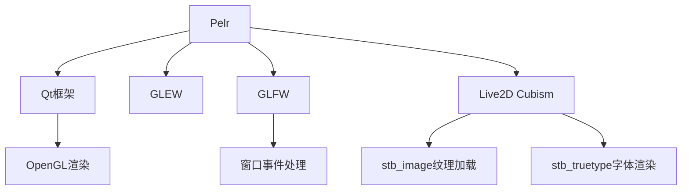

# Pelr 第三方库清单说明文档

**Generated by DeepSeek R1**

详见：https://github.com/csy214-beep/Pelr/blob/master/CMakeLists.txt

## 项目概述
Pelr 是一款基于 Live2D 角色驱动的启动器应用，使用 C++ 和 Qt 框架开发，整合了多种第三方库以实现图形渲染、动画驱动和跨平台功能。

## 第三方库清单

| 分类 | 库名称 | 版本 | 用途说明 | 许可协议 | 官方来源 |
|------|--------|------|----------|----------|----------|
| GUI框架 | Qt | 5.15.2 | 跨平台应用开发(UI/网络/数据库/多媒体等) | LGPLv3/GPL | [qt.io](https://www.qt.io) |
| 图形渲染 | GLEW | 2.1.0 | OpenGL扩展加载和管理 | MIT | [glew.sourceforge.net](http://glew.sourceforge.net/) |
| 图形渲染 | GLFW | 3.4.0 | 窗口和上下文管理 | MIT | [glfw.org](https://www.glfw.org/) |
| 2D动画引擎 | Live2D Cubism Core | SDK内置 | 二次元角色动画渲染 | 专有协议 | [live2d.com](https://www.live2d.com) |
| 图像处理 | stb_image | 2.30 | 多格式图像加载(PNG/JPG/BMP等) | MIT/Public Domain | [github.com/nothings/stb](https://github.com/nothings/stb) |
| 图像处理 | stb_truetype | 1.26 | TrueType字体光栅化 | MIT/Public Domain | [github.com/nothings/stb](https://github.com/nothings/stb) |
| 图像处理 | stb_image_resize2 | 2.12 | 高质量图像缩放 | MIT/Public Domain | [github.com/nothings/stb](https://github.com/nothings/stb) |
| 数据结构 | stb_ds | 0.67 | C语言动态数组和哈希表 | MIT/Public Domain | [github.com/nothings/stb](https://github.com/nothings/stb) |
| 打包工具 | PyInstaller | 6.15.0 | 应用打包和分发 | GPL | [pyinstaller.org](https://www.pyinstaller.org/) |
| Windows支持 | pywin32-ctypes | 0.2.3 | Windows API调用支持 | BSD | [pypi.org](https://pypi.org/project/pywin32-ctypes/) |

## 核心库详细说明

### 1. Qt框架
- **包含模块**: Core, Gui, Widgets, Network, OpenGL, SerialPort, Sql, Svg, WebChannel, WebSockets, Multimedia, UiTools
- **主要功能**: 提供跨平台UI开发、网络通信、数据库访问和多媒体支持
- **集成方式**: 通过CMake链接Qt5组件

### 2. GLEW (OpenGL Extension Wrangler)
- **功能**: 动态加载OpenGL扩展函数(如glGenBuffers)
- **支持范围**: OpenGL 2.1至4.6核心功能
- **集成方式**:
```cmake
target_link_libraries(Pelr libglew32d.dll)
```

### 3. GLFW (Graphics Library Framework)
- **功能**: 创建OpenGL上下文窗口，处理输入事件，多显示器适配
- **代码引用**:
```cpp
#include <GLFW/glfw3.h>
```

### 4. Live2D Cubism Core
- **模块组成**:
  - CubismFramework: 动画逻辑核心
  - CubismNativeCore: 原生渲染接口
- **关键类**:
```cpp
class LAppModel : public Csm::CubismUserModel { ... }
```

### 5. STB单文件库
- **使用方式**:
```cpp
#define STB_IMAGE_IMPLEMENTATION
#include "stb_image.h"
```
- **安全注意**: stb_image已知存在安全漏洞(如CVE-2021-28038)，需定期更新版本

## 依赖关系图



## 注意事项

1. **Qt版本要求**: 必须使用Qt 5.15.2 (MingW81_64)版本编译，否则可能导致兼容性问题
2. **构建模式区别**: Debug模式链接Live2DCubismCore_d.lib，Release模式使用无后缀版本
3. **安全建议**: 处理不可信输入时，禁用stb_image的危险格式支持(如STBI_NO_PSD)
4. **许可证合规**: 注意Qt的LGPL许可要求，以及Live2D的专有协议限制

---
*本文档仅供参考，具体库的使用请以各库官方文档为准*