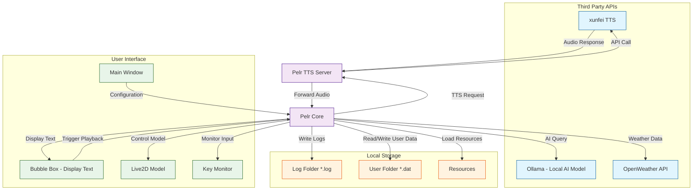

Welcome to the Pelr wiki!

**Program structure**

[IMPORTANT](https://gitee.com/Pfolg/Pelr/wikis/IMPORTANT)

[使用方法](https://gitee.com/Pfolg/Pelr/wikis/%E4%BD%BF%E7%94%A8%E6%96%B9%E6%B3%95)

技术栈

+ [C++ 工具链](https://gitee.com/Pfolg/Pelr/wikis/Cpp-%E5%B7%A5%E5%85%B7%E9%93%BE)

+ [Python 工具链](https://gitee.com/Pfolg/Pelr/wikis/Python-%E5%B7%A5%E5%85%B7%E9%93%BE)

[构建流程](https://gitee.com/Pfolg/Pelr/wikis/%E6%9E%84%E5%BB%BA%E6%B5%81%E7%A8%8B)

