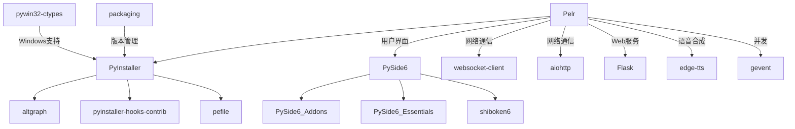

# 第三方库清单说明文档

**Generated by DeepSeek R1**

详见：<https://gitee.com/Pfolg/Pelr/blob/master/requirements.txt>

---

## **项目名称**

Pelr (Live2D 角色驱动型启动器) - Python 工具链

---

## **第三方库概览**

| **分类**         | **库名**                    | **版本**    | **用途**                                             | **授权协议**       | **来源**                                                             |
|----------------|---------------------------|-----------|----------------------------------------------------|----------------|--------------------------------------------------------------------|
| **打包工具**       | PyInstaller               | 6.18.0    | 应用打包与分发                                            | GPL            | [PyInstaller](https://www.pyinstaller.org)                         |
|                | pyinstaller-hooks-contrib | 2026.0    | PyInstaller 附加钩子支持                                 | GPL            | [GitHub](https://github.com/pyinstaller/pyinstaller-hooks-contrib) |
| **依赖分析**       | altgraph                  | 0.17.5    | 图形化依赖分析工具                                          | MIT            | [PyPI](https://pypi.org/project/altgraph/)                         |
| **Windows工具链** | pywin32-ctypes            | 0.2.3     | Windows API 调用                                     | BSD            | [PyPI](https://pypi.org/project/pywin32-ctypes)                    |
|                | pefile                    | 2024.8.26 | PE文件格式解析                                           | MIT            | [GitHub](https://github.com/erocarrera/pefile)                     |
| **网络通信**       | websocket-client          | 1.9.0     | WebSocket 客户端实现                                    | LGPL           | [GitHub](https://github.com/websocket-client/websocket-client)     |
|                | aiohttp                   | 3.13.4    | 异步HTTP客户端/服务器                                      | Apache-2.0     | [aiohttp](https://docs.aiohttp.org)                                |
|                | aiohappyeyeballs          | 2.6.1     | 异步连接加速                                             | MIT            | [PyPI](https://pypi.org/project/aiohappyeyeballs)                  |
|                | aiosignal                 | 1.4.0     | 异步信号分发                                             | MIT            | [PyPI](https://pypi.org/project/aiosignal)                         |
|                | frozenlist                | 1.8.0     | 不可变列表                                              | Apache-2.0     | [PyPI](https://pypi.org/project/frozenlist)                        |
|                | multidict                 | 6.7.1     | 多键值字典                                              | Apache-2.0     | [PyPI](https://pypi.org/project/multidict)                         |
|                | yarl                      | 1.23.0    | URL解析                                              | Apache-2.0     | [PyPI](https://pypi.org/project/yarl)                              |
|                | propcache                 | 0.4.1     | 属性缓存                                               | Apache-2.0     | [PyPI](https://pypi.org/project/propcache)                         |
| **工具辅助**       | packaging                 | 26.0      | 包版本与依赖管理                                           | Apache-2.0/BSD | [PyPI](https://pypi.org/project/packaging/)                        |
|                | python-dotenv             | 1.2.2     | 环境变量加载                                             | BSD-3-Clause   | [PyPI](https://pypi.org/project/python-dotenv)                     |
|                | tabulate                  | 0.10.0    | 表格输出                                               | MIT            | [PyPI](https://pypi.org/project/tabulate)                          |
|                | typing_extensions         | 4.15.0    | 类型注解扩展                                             | Python-2.0     | [PyPI](https://pypi.org/project/typing-extensions)                 |
|                | emoji                     | 2.15.0    | Emoji处理                                            | BSD-3-Clause   | [PyPI](https://pypi.org/project/emoji)                             |
|                | colorama                  | 0.4.6     | 终端彩色输出                                             | BSD-3-Clause   | [PyPI](https://pypi.org/project/colorama)                          |
|                | certifi                   | 2026.2.25 | CA证书集                                              | MPL-2.0        | [PyPI](https://pypi.org/project/certifi)                           |
|                | idna                      | 3.11      | 国际化域名处理                                            | BSD-3-Clause   | [PyPI](https://pypi.org/project/idna)                              |
|                | attrs                     | 26.1.0    | 简化类定义                                              | MIT            | [PyPI](https://pypi.org/project/attrs)                             |
|                | cffi                      | 2.0.0     | C函数接口                                              | MIT            | [PyPI](https://pypi.org/project/cffi)                              |
|                | pycparser                 | 3.0       | C语法解析                                              | BSD-3-Clause   | [PyPI](https://pypi.org/project/pycparser)                         |
| **GUI框架**      | PySide6                   | 6.10.1    | Qt for Python 跨平台GUI框架                             | LGPL           | [Qt for Python](https://doc.qt.io/qt-6/pyside6-index.html)         |
|                | PySide6_Addons            | 6.10.1    | PySide6 附加模块                                       | LGPL           | [Qt for Python](https://doc.qt.io/qt-6/pyside6-index.html)         |
|                | PySide6_Essentials        | 6.10.1    | PySide6 核心模块                                       | LGPL           | [Qt for Python](https://doc.qt.io/qt-6/pyside6-index.html)         |
| **绑定工具**       | shiboken6                 | 6.10.1    | Python/C++ 绑定生成器                                   | LGPL           | [Qt for Python](https://doc.qt.io/qt-6/pyside6-index.html)         |
| **Web框架**      | Flask                     | 3.1.3     | 轻量级Web框架                                           | BSD-3-Clause   | [Flask](https://flask.palletsprojects.com)                         |
|                | Werkzeug                  | 3.1.7     | WSGI工具库                                            | BSD-3-Clause   | [Werkzeug](https://werkzeug.palletsprojects.com)                   |
|                | Jinja2                    | 3.1.6     | 模板引擎                                               | BSD-3-Clause   | [Jinja2](https://palletsprojects.com/p/jinja/)                     |
|                | MarkupSafe                | 3.0.3     | 字符串转义                                              | BSD-3-Clause   | [PyPI](https://pypi.org/project/MarkupSafe)                        |
|                | itsdangerous              | 2.2.0     | 数据签名                                               | BSD-3-Clause   | [PyPI](https://pypi.org/project/itsdangerous)                      |
|                | blinker                   | 1.9.0     | 信号通知                                               | MIT            | [PyPI](https://pypi.org/project/blinker)                           |
|                | click                     | 8.3.1     | 命令行界面                                              | BSD-3-Clause   | [PyPI](https://pypi.org/project/click)                             |
| **语音合成**       | edge-tts                  | 7.2.8     | 微软Edge TTS服务                                       | GPL-3.0        | [GitHub](https://github.com/rany2/edge-tts)                        |
|                | openai-edge-tts           | 2.0.0     | local, OpenAI-compatible  (TTS) API using edge-tts | GPL-3.0        | [GitHub](https://github.com/travisvn/openai-edge-tts)              |
| **并发工具**       | gevent                    | 25.9.1    | 协程并发网络库                                            | MIT            | [gevent](http://www.gevent.org)                                    |
|                | greenlet                  | 3.3.2     | 协程上下文切换                                            | MIT            | [PyPI](https://pypi.org/project/greenlet)                          |
|                | zope.event                | 6.1       | 事件发布订阅                                             | ZPL-2.1        | [PyPI](https://pypi.org/project/zope.event)                        |
|                | zope.interface            | 8.2       | 接口定义                                               | ZPL-2.1        | [PyPI](https://pypi.org/project/zope.interface)                    |

---

## **核心库详细说明**

### **1. PyInstaller**

- **核心功能**
    - 将 Python 应用程序及其所有依赖项打包成单个可执行文件
    - 支持 Windows、Linux 和 macOS 等多平台打包
    - 提供单文件模式与目录模式两种分发方式

- **集成方式**

  ```bash
  pyinstaller -w tts_server.py
  ```

### **2. PySide6**

- **功能特性**
    - 完整的 Qt 6 框架 Python 绑定
    - 提供丰富的 GUI 组件和跨平台支持
    - 支持信号槽机制、多线程、国际化等功能

- **关键作用**
    - 构建 Pelr 的用户界面
    - 管理窗口、对话框和控件布局
    - 处理用户交互和事件响应

### **3. pywin32-ctypes**

- **核心能力**
    - 提供对 Windows API 的纯 Python 访问
    - 无需安装完整的 pywin32 包
    - 支持进程管理、注册表操作等系统级功能

### **4. websocket-client**

- **关键作用**
    - 实现 WebSocket 协议客户端功能
    - 提供实时双向通信能力
    - 支持与后端服务进行实时数据交换

### **5. 其他工具库**

- **altgraph**: 为 PyInstaller 提供依赖图分析功能
- **pefile**: 解析 Windows PE 文件格式，用于可执行文件分析
- **packaging**: 提供版本规范解析和依赖管理功能
- **pyinstaller-hooks-contrib**: 社区维护的 PyInstaller 钩子扩展
- **shiboken6**: 用于生成 PySide6 的 Python/C++ 绑定
- **aiohttp**: 异步 HTTP 网络库，用于高性能网络请求
- **Flask**: 轻量级 Web 框架，用于本地服务接口
- **edge-tts**: 微软 Edge TTS 服务调用，实现语音合成
- **gevent**: 基于协程的并发库，提升网络 I/O 性能

---

## **依赖关系图**



---

## **工具链分析**

### **打包流程**

1. **依赖分析**: 使用 altgraph 分析项目依赖关系
2. **资源收集**: 通过 PyInstaller 收集所有必要资源文件
3. **钩子处理**: 使用 pyinstaller-hooks-contrib 处理特殊库的打包需求
4. **PE文件处理**: 使用 pefile 分析生成的可执行文件结构
5. **Windows集成**: 通过 pywin32-ctypes 处理Windows特定功能

### **运行时功能**

1. **GUI界面**: 使用 PySide6 构建跨平台用户界面
2. **网络通信**: 使用 websocket-client 和 aiohttp 与后端服务通信
3. **Web服务**: 使用 Flask 提供本地控制接口
4. **语音合成**: 使用 edge-tts 生成角色语音
5. **系统集成**: 通过 pywin32-ctypes 访问 Windows 系统功能
6. **并发处理**: 使用 gevent 提升网络并发性能

---

## **注意事项**

1. **许可证兼容性**
    - PyInstaller 使用 GPL 协议，分发时需注意许可证兼容性要求
    - PySide6 使用 LGPL 协议，适合商业应用开发
    - edge-tts 使用 GPL-3.0 协议，二次分发需遵守相应条款

2. **Windows 依赖**
    - 使用 pywin32-ctypes 和 pefile 时需确保目标系统为 Windows 环境

3. **版本锁定**
    - 建议锁定 PyInstaller 及相关工具版本以确保构建一致性
    - PySide6 各组件需保持版本一致

4. **安全考虑**
    - 定期更新依赖库以获取安全补丁，特别是网络通信相关库

5. **跨平台兼容性**
    - PySide6 支持跨平台，但在不同平台上的表现可能有所差异，需进行测试

---

*本文档仅供参考，具体库的使用请以各库官方文档为准*