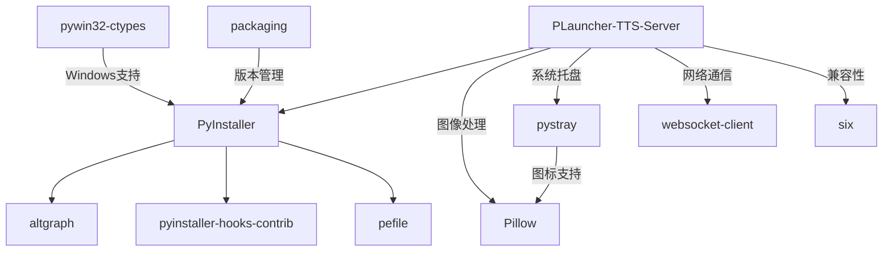

# 第三方库清单说明文档

**Generated by DeepSeek R1**

详见：https://gitee.com/Pfolg/plauncher/blob/master/scripts/requirements.txt

---

## **项目名称**  
PLauncher (Live2D 角色驱动型启动器) - Python 工具链


---

## **第三方库概览**

| **分类**          | **库名**                  | **版本**       | **用途**                                  | **授权协议**       | **来源**                          |
|--------------------|---------------------------|---------------|-------------------------------------------|--------------------|-----------------------------------|
| **打包工具**       | PyInstaller               | 6.15.0        | 应用打包与分发                            | GPL                | [PyInstaller](https://www.pyinstaller.org) |
|                    | pyinstaller-hooks-contrib | 2025.8        | PyInstaller 附加钩子支持                  | GPL                | [GitHub](https://github.com/pyinstaller/pyinstaller-hooks-contrib) |
| **依赖分析**       | altgraph                  | 0.17.4        | 图形化依赖分析工具                        | MIT                | [PyPI](https://pypi.org/project/altgraph/) |
| **Windows工具链**  | pywin32-ctypes            | 0.2.3         | Windows API 调用                         | BSD                | [PyPI](https://pypi.org/project/pywin32-ctypes) |
|                    | pefile                    | 2023.2.7      | PE文件格式解析                           | MIT                | [GitHub](https://github.com/erocarrera/pefile) |
| **图像处理**       | Pillow                    | 11.3.0        | 图像处理功能增强                          | HPND               | [Python Pillow](https://python-pillow.org) |
| **系统集成**       | pystray                   | 0.19.5        | 系统托盘图标支持                          | LGPL               | [GitHub](https://github.com/moses-palmer/pystray) |
| **网络通信**       | websocket-client          | 1.8.0         | WebSocket 客户端实现                     | LGPL               | [GitHub](https://github.com/websocket-client/websocket-client) |
| **兼容性工具**     | six                       | 1.17.0        | Python 2/3 兼容性库                      | MIT                | [PyPI](https://pypi.org/project/six/) |
| **工具辅助**       | packaging                 | 25.0          | 包版本与依赖管理                          | Apache-2.0/BSD     | [PyPI](https://pypi.org/project/packaging/) |

---

## **核心库详细说明**

### **1. PyInstaller**  
- **核心功能**  
  - 将 Python 应用程序及其所有依赖项打包成单个可执行文件
  - 支持 Windows、Linux 和 macOS 等多平台打包
  - 提供单文件模式与目录模式两种分发方式

- **集成方式**  
  ```bash
  pyinstaller --onefile --windowed plauncher.py
  ```

### **2. Pillow (PIL Fork)**  
- **功能特性**  
  - 提供广泛的图像文件格式支持（JPEG, PNG, BMP, GIF, TIFF 等）
  - 图像处理功能（缩放、裁剪、旋转、滤镜等）
  - 图像显示支持（可用于预览和调试）

- **关键作用**  
  - 处理应用程序中的图标和背景图像
  - 支持 Live2D 模型纹理的预处理
  - <u>生成系统托盘图标所需的各种尺寸图像</u>

### **3. pystray**  
- **核心能力**  
  - 创建和管理系统托盘图标应用程序
  - 支持右键上下文菜单
  - 跨平台系统托盘集成（Windows/macOS/Linux）

- **集成示例**  
  ```python
  import pystray
  from PIL import Image
  
  # 创建系统托盘图标
  image = Image.open("icon.png")
  menu = pystray.Menu(pystray.MenuItem('退出', exit_app))
  icon = pystray.Icon("PLauncher", image, "PLauncher", menu)
  icon.run()
  ```

### **4. pywin32-ctypes**  
- **核心能力**  
  - 提供对 Windows API 的纯 Python 访问
  - 无需安装完整的 pywin32 包
  - 支持进程管理、注册表操作等系统级功能

### **5. websocket-client**  
- **关键作用**  
  - 实现 WebSocket 协议客户端功能
  - 提供实时双向通信能力
  - 支持与后端服务进行实时数据交换

### **6. six**  
- **功能特性**  
  - 提供 Python 2 和 3 兼容性工具函数
  - 简化跨版本代码编写
  - 包含常用兼容性包装器

### **7. 其他工具库**  
- **altgraph**: 为 PyInstaller 提供依赖图分析功能
- **pefile**: 解析 Windows PE 文件格式，用于可执行文件分析
- **packaging**: 提供版本规范解析和依赖管理功能
- **pyinstaller-hooks-contrib**: 社区维护的 PyInstaller 钩子扩展

---

## **依赖关系图**



---

## **工具链分析**

### **打包流程**
1. **依赖分析**: 使用 altgraph 分析项目依赖关系
2. **资源收集**: 通过 PyInstaller 收集所有必要资源文件
3. **钩子处理**: 使用 pyinstaller-hooks-contrib 处理特殊库的打包需求
4. **PE文件处理**: 使用 pefile 分析生成的可执行文件结构
5. **Windows集成**: 通过 pywin32-ctypes 处理Windows特定功能

### **运行时功能**
1. **图像处理**: 使用 Pillow 处理应用程序中的所有图像需求
2. **系统集成**: 通过 pystray 实现系统托盘功能
3. **网络通信**: 使用 websocket-client 与后端服务通信
4. **兼容性保障**: 通过 six 库确保代码在不同Python版本间的兼容性

---

## **注意事项**

1. **许可证兼容性**  
   - PyInstaller 使用 GPL 协议，分发时需注意许可证兼容性要求
   - Pillow 使用 HPND 协议，与大多数开源许可证兼容

2. **Windows 依赖**  
   - 使用 pywin32-ctypes 和 pefile 时需确保目标系统为 Windows 环境

3. **版本锁定**  
   - 建议锁定 PyInstaller 及相关工具版本以确保构建一致性
   - 特别注意 six 库的版本，不同版本间API可能有变化

4. **安全考虑**  
   - 定期更新依赖库以获取安全补丁，特别是网络通信相关库
   - 处理用户提供的图像文件时，注意Pillow的潜在安全风险

5. **系统托盘兼容性**  
   - pystray 在不同平台上的表现可能有所差异，需进行跨平台测试

---
*本文档仅供参考，具体库的使用请以各库官方文档为准*
