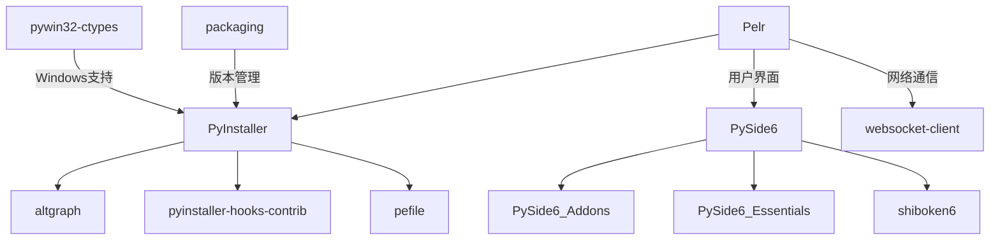

# 第三方库清单说明文档

**Generated by DeepSeek R1**

详见：<https://gitee.com/Pfolg/Pelr/blob/master/requirements.txt>

---

## **项目名称**

Pelr (Live2D 角色驱动型启动器) - Python 工具链

---

## **第三方库概览**

| **分类**          | **库名**                  | **版本**       | **用途**                                  | **授权协议**       | **来源**                          |
|--------------------|---------------------------|---------------|-------------------------------------------|--------------------|-----------------------------------|
| **打包工具**       | PyInstaller               | 6.18.0        | 应用打包与分发                            | GPL                | [PyInstaller](https://www.pyinstaller.org) |
|                    | pyinstaller-hooks-contrib | 2026.0        | PyInstaller 附加钩子支持                  | GPL                | [GitHub](https://github.com/pyinstaller/pyinstaller-hooks-contrib) |
| **依赖分析**       | altgraph                  | 0.17.5        | 图形化依赖分析工具                        | MIT                | [PyPI](https://pypi.org/project/altgraph/) |
| **Windows工具链**  | pywin32-ctypes            | 0.2.3         | Windows API 调用                         | BSD                | [PyPI](https://pypi.org/project/pywin32-ctypes) |
|                    | pefile                    | 2024.8.26     | PE文件格式解析                           | MIT                | [GitHub](https://github.com/erocarrera/pefile) |
| **网络通信**       | websocket-client          | 1.9.0         | WebSocket 客户端实现                     | LGPL               | [GitHub](https://github.com/websocket-client/websocket-client) |
| **工具辅助**       | packaging                 | 26.0          | 包版本与依赖管理                          | Apache-2.0/BSD     | [PyPI](https://pypi.org/project/packaging/) |
| **GUI框架**        | PySide6                   | 6.10.1        | Qt for Python 跨平台GUI框架              | LGPL               | [Qt for Python](https://doc.qt.io/qt-6/pyside6-index.html) |
|                    | PySide6_Addons            | 6.10.1        | PySide6 附加模块                         | LGPL               | [Qt for Python](https://doc.qt.io/qt-6/pyside6-index.html) |
|                    | PySide6_Essentials        | 6.10.1        | PySide6 核心模块                         | LGPL               | [Qt for Python](https://doc.qt.io/qt-6/pyside6-index.html) |
| **绑定工具**       | shiboken6                 | 6.10.1        | Python/C++ 绑定生成器                    | LGPL               | [Qt for Python](https://doc.qt.io/qt-6/pyside6-index.html) |

---

## **核心库详细说明**

### **1. PyInstaller**

- **核心功能**
  - 将 Python 应用程序及其所有依赖项打包成单个可执行文件
  - 支持 Windows、Linux 和 macOS 等多平台打包
  - 提供单文件模式与目录模式两种分发方式

- **集成方式**

  ```bash
  pyinstaller -w tts_server.py
  ```

### **2. PySide6**

- **功能特性**
  - 完整的 Qt 6 框架 Python 绑定
  - 提供丰富的 GUI 组件和跨平台支持
  - 支持信号槽机制、多线程、国际化等功能

- **关键作用**
  - 构建 Pelr 的用户界面
  - 管理窗口、对话框和控件布局
  - 处理用户交互和事件响应

### **3. pywin32-ctypes**

- **核心能力**
  - 提供对 Windows API 的纯 Python 访问
  - 无需安装完整的 pywin32 包
  - 支持进程管理、注册表操作等系统级功能

### **4. websocket-client**

- **关键作用**
  - 实现 WebSocket 协议客户端功能
  - 提供实时双向通信能力
  - 支持与后端服务进行实时数据交换

### **5. 其他工具库**

- **altgraph**: 为 PyInstaller 提供依赖图分析功能
- **pefile**: 解析 Windows PE 文件格式，用于可执行文件分析
- **packaging**: 提供版本规范解析和依赖管理功能
- **pyinstaller-hooks-contrib**: 社区维护的 PyInstaller 钩子扩展
- **shiboken6**: 用于生成 PySide6 的 Python/C++ 绑定

---

## **依赖关系图**



---

## **工具链分析**

### **打包流程**

1. **依赖分析**: 使用 altgraph 分析项目依赖关系
2. **资源收集**: 通过 PyInstaller 收集所有必要资源文件
3. **钩子处理**: 使用 pyinstaller-hooks-contrib 处理特殊库的打包需求
4. **PE文件处理**: 使用 pefile 分析生成的可执行文件结构
5. **Windows集成**: 通过 pywin32-ctypes 处理Windows特定功能

### **运行时功能**

1. **GUI界面**: 使用 PySide6 构建跨平台用户界面
2. **网络通信**: 使用 websocket-client 与后端服务通信
3. **系统集成**: 通过 pywin32-ctypes 访问 Windows 系统功能

---

## **注意事项**

1. **许可证兼容性**
   - PyInstaller 使用 GPL 协议，分发时需注意许可证兼容性要求
   - PySide6 使用 LGPL 协议，适合商业应用开发

2. **Windows 依赖**
   - 使用 pywin32-ctypes 和 pefile 时需确保目标系统为 Windows 环境

3. **版本锁定**
   - 建议锁定 PyInstaller 及相关工具版本以确保构建一致性
   - PySide6 各组件需保持版本一致

4. **安全考虑**
   - 定期更新依赖库以获取安全补丁，特别是网络通信相关库

5. **跨平台兼容性**
   - PySide6 支持跨平台，但在不同平台上的表现可能有所差异，需进行测试

---

*本文档仅供参考，具体库的使用请以各库官方文档为准*
