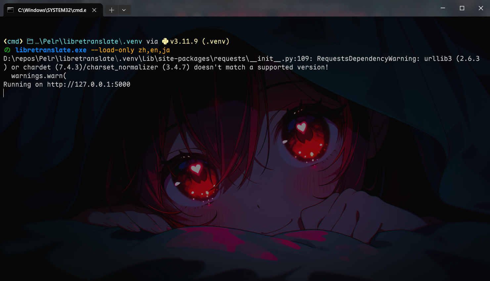
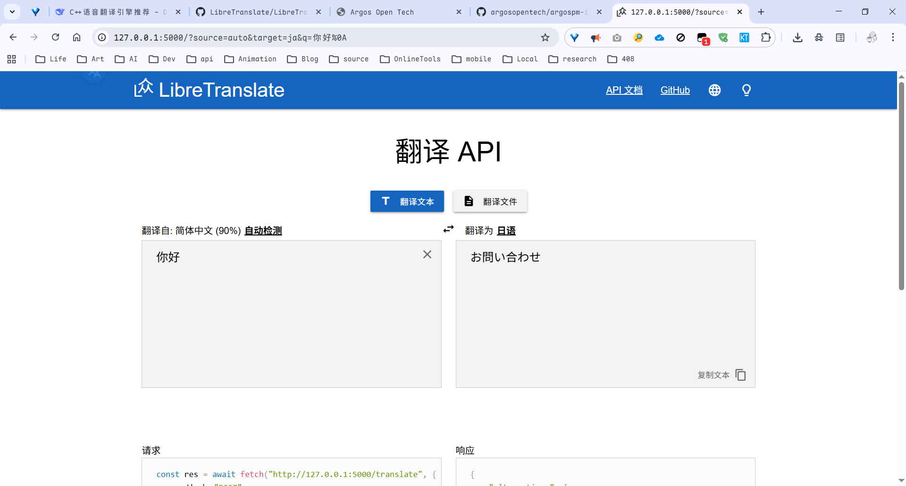

LibreTranslate 离线翻译服务使用说明（Python 版）

## 相关链接

<https://github.com/LibreTranslate/LibreTranslate>

<https://github.com/argosopentech/argospm-index>

<https://www.argosopentech.com/argospm/index/>

---

## 用户配置指南（仅供本地使用）

本指南将帮助你在一台 Windows 电脑上通过 Python 虚拟环境运行一个完全离线的翻译服务，支持中文 ↔ 日文互译，也可以通过浏览器或其它软件调用。

> 你不需要会编程，只需按步骤操作即可。

---

### 第一步：安装 Python

1. 访问 Python 官网：<https://www.python.org/downloads/>
2. 下载 **Windows 版**（建议选 Python 3.10 或 3.11，不要选最新的 3.13，避免兼容问题）
3. 双击安装，**务必勾选** `Add Python to PATH`（添加到环境变量）
4. 一路默认安装即可

---

### 第二步：创建虚拟环境（隔离运行环境）

1. 在你电脑上新建一个文件夹，例如 `D:\libretranslate_py`
2. 打开 **命令提示符**（CMD），输入以下命令进入该文件夹：

   ```cmd
   cd /d D:\libretranslate_py
   ```

3. 创建 Python 虚拟环境：

   ```cmd
   python -m venv venv
   ```

4. 激活虚拟环境：

   ```cmd
   venv\Scripts\activate
   ```

   成功激活后，命令行前面会出现 `(venv)` 字样。

---

### 第三步：安装 LibreTranslate

在虚拟环境激活状态下，执行：

```cmd
pip install libretranslate
```

> 如果下载慢，可以换成国内镜像源：
>
> ```cmd
> pip install libretranslate -i https://pypi.tuna.tsinghua.edu.cn/simple
> ```

---

### 第四步：启动并自动下载模型

**首次启动时，LibreTranslate 会自动下载所需的语言模型（中文、英文、日文）。** 整个过程无需你手动干预。

在命令提示符中（确保虚拟环境已激活），执行：

```cmd
libretranslate --load-only zh,en,ja
```

服务启动后，你会看到类似这样的输出：

```
Updating language models
Downloading Chinese → English ...
Downloading English → Japanese ...
...
Listening at: http://0.0.0.0:5000
```

<details>
<summary>预览</summary>



</details>

> **注意**：首次下载模型需要连接 GitHub 等国外网站，如果网络较慢或失败，请参考下面的“自动下载失败怎么办”部分。

---

### 第五步：验证是否成功

打开浏览器，访问 `http://localhost:5000`，应该能看到翻译网页界面。

在下拉框中分别选择“Chinese (zh)” 和 “Japanese (ja)”，输入中文测试翻译效果。

---

### 第六步：如何供其他软件调用

- 翻译 API 地址：`http://localhost:5000/translate`
- 调用方式：HTTP POST，JSON 格式，例如：

  ```json
  { "q": "你好", "source": "zh", "target": "ja" }
  ```

- 任何支持 HTTP 请求的软件都可以使用这个离线翻译服务。

---

### 常见问题

**Q: 启动时提示“端口 5000 已被占用”怎么办？**
A: 可以换一个端口，例如：

```cmd
libretranslate --port 5001 --load-only zh,en,ja
```

然后访问 `http://localhost:5001` 即可。

**Q: 自动下载模型失败或特别慢怎么办？**
A: 这是因为国内访问 GitHub 较慢。你可以尝试以下几种方法：

1. **使用代理**（如果你有）：在命令提示符中设置环境变量，启用代理后再启动：

   ```cmd
   set HTTP_PROXY=http://你的代理地址:端口
   set HTTPS_PROXY=http://你的代理地址:端口
   libretranslate --load-only zh,en,ja
   ```

2. **换个时间再试**：有时凌晨或周末网络会好些。
3. ... (doge.

**Q: 如何关闭服务？**
A: 直接在命令提示符窗口按 `Ctrl + C`，然后输入 `y` 确认。

**Q: 能否让服务开机自启动？**
A: 可以将启动命令写成批处理文件（.bat），然后放入“启动”文件夹。但本指南不详细介绍。

**Q: 我想支持更多语言（如韩语），怎么添加模型？**
A: 启动参数加上对应语言代码，例如 `--load-only zh,en,ja,ko`，服务启动时会自动下载韩语模型。

---

## 🤖 如果还有问题，复制下面这段话发给 AI

你可以将以下内容复制给任意 AI 助手（如 DeepSeek、ChatGPT），它会帮助你解决配置中的问题：

```
【我需要帮助】我正在尝试在 Windows 上通过 Python 虚拟环境运行 LibreTranslate 离线翻译服务。

我已经按照以下步骤操作：
1. 安装了 Python 3.11
2. 在 D:\libretranslate_py 创建了虚拟环境并激活
3. 执行了 pip install libretranslate
4. 执行了 libretranslate --load-only zh,en,ja

启动时出现以下问题：

【请在此处粘贴出现的错误信息，例如无法下载模型、IndexError、端口冲突等】

请帮我分析问题原因，并给出解决步骤。最好用非技术用户能听懂的话解释。
```

将上面的【】中的内容替换成你实际遇到的问题，然后发送给 AI，就能获得详细的帮助了。

---

## 附录：典型配置预览

<details>
<summary>预览</summary>



</details>

> 注意：首次启动后，Web 界面底部会显示已加载的语言模型；如果只加载了中文和日文，界面中的语言选项也会相应显示。
