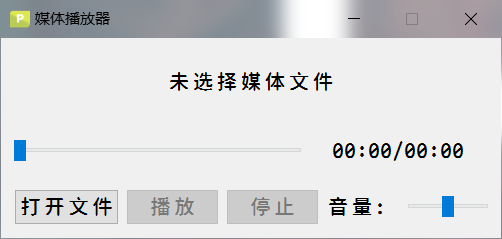
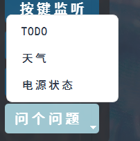
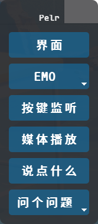
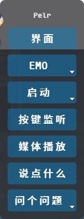
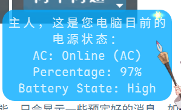
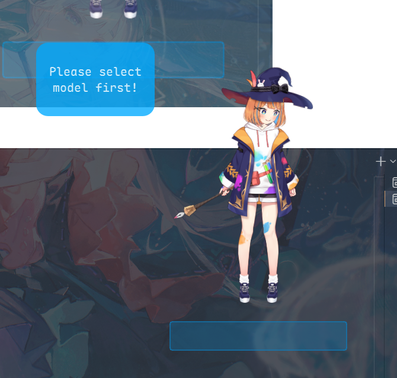
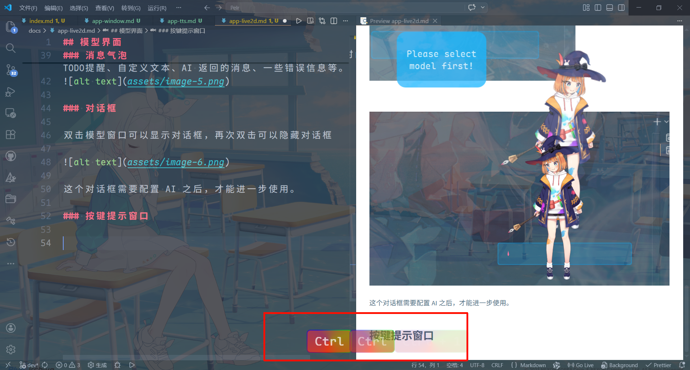
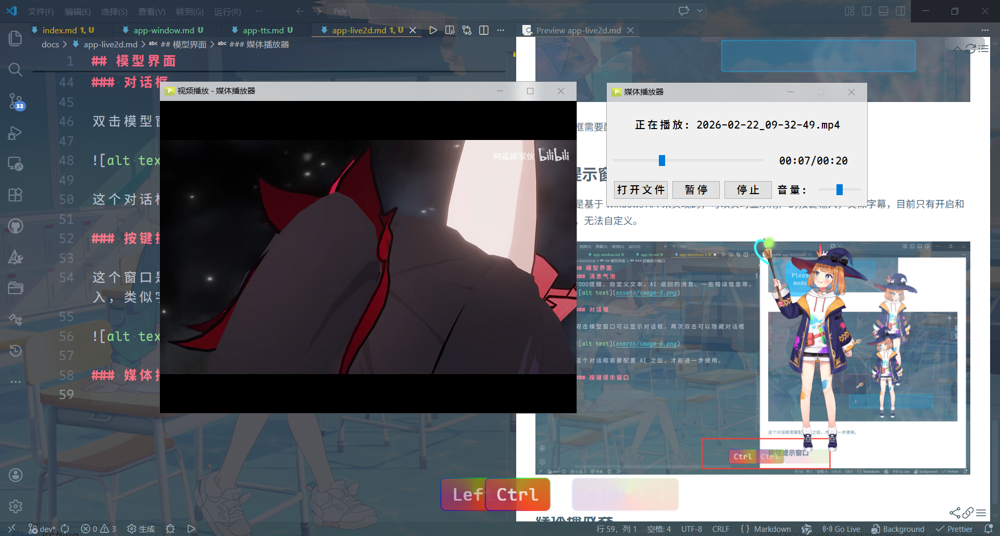

## 模型界面

这个是程序最主要的界面，用户所选择的模型会展示在这个窗口。

这个界面包括了多个子窗口，但它们并没有上下关系：

- `GLCore 窗口` 通过 OpenGL 渲染出来的模型窗口
- `右键菜单` 点击右键可以展示多个选项
- `消息气泡`
- `对话框`
- `按键提示窗口`
- `媒体播放器`

### GLCore 窗口

用户可以在这个窗口上与模型交互，模型会展示出一些特有的动作，如果模型不支持相关的功能，则交互没有太大的意义。

长按模型可以对窗口进行拖动

### 右键菜单

右击模型可以显示右键菜单，当窗口失去焦点之后，右键菜单自动隐藏

- 点击`界面`会弹出主窗口
- 点击 `EMO` 会弹出表情/动作选择菜单
- 点击`启动`，会弹出启动菜单
- 点击`按键监听`,程序会启动按键监听功能会在屏幕下方显示类似字幕的按键气泡
- 点击`媒体播放`可以打开一个简陋的音频/视频播放窗口

预览

- 点击`说点什么`，会弹出一个预定义好文本的气泡，这个可以在设置里面自行定义

预览

  

- 点击`问个问题`，会显示一些预定好的问题选项

预览

当用户配置了启动项之后，右键菜单会多一个菜单：

预览

 

### 消息气泡

消息气泡不具有交互功能，只会显示一些预定好的消息，如时间提醒、TODO提醒、自定义文本、AI 返回的消息、一些错误信息等。

预览

### 对话框

双击模型窗口可以显示对话框，再次双击可以隐藏对话框

预览

这个对话框需要配置 AI 之后，才能进一步使用。

### 按键提示窗口

这个窗口是基于 Windows API 来实现的，可以实时显示用户的按键输入，类似字幕，目前只有开启和关闭功能，无法自定义。

预览

### 媒体播放器

这个窗口可以用来播放视频和音频，但是需要下载依赖，在检测到用户电脑上没有这个依赖时，指导用户前往相关仓库进行下载，如果不需要该功能，可不用关注这个功能

预览

