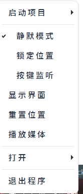
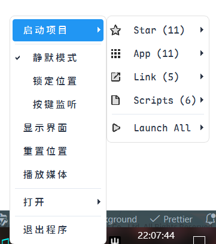
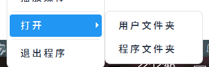

## 托盘

托盘是本软件比较核心的一个功能

预览

### 启动项目

这里的`启动项目`功能和右键菜单里面的`启动`菜单是一样的，他们是一个单例，在两个 UI 里面的引用。

点击启动项目，可以启动一些预定义好的项目

预览

### 静默模式

启用`静默模式`可以隐藏模型，再次点击`静默模式`可以显示模型。

启用`静默模式`后，模型不会发送消息打扰用户。

### 锁定位置

锁定位置功能可以锁定模型在屏幕上的位置，再次点击`锁定位置`可以取消锁定。

### 按键监听

按键监听功能可以实时显示用户按键输入，类似字幕，目前只有开启和关闭功能，无法自定义。

### 显示界面

显示界面功能可以显示主界面，推荐使用双击托盘显示界面，再次双击之后可以隐藏界面。

### 重置位置

`重置位置`可以帮助用户把模型重置到屏幕中央，大小变为150。

### 播放媒体

播放媒体功能可以播放视频和音频，但是需要下载依赖，在检测到用户电脑上没有这个依赖时，指导用户前往相关仓库进行下载，如果不需要该功能，可不用关注这个功能。

### 打开

`打开`功能可以打开`用户文件夹`和`程序文件夹`

预览

### 退出程序

`退出程序`功能可以退出程序

用户也可以对模型按 Alt + F4 键退出程序
