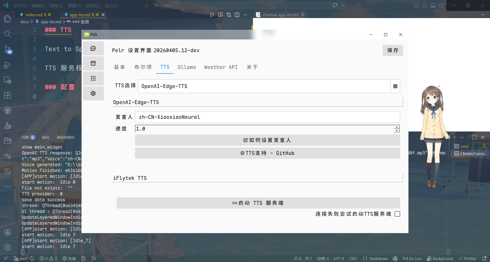

### TTS

Text to Speech

TTS 服务程序，用于将文本转换为语音。

### 配置

在设置界面的 TTS 菜单里面可以进行配置。

可以选择免费的 OpenAI-Edge-GTS 和付费但高质量的讯飞 TTS 服务。

预览

### TTS 服务程序

TTS 服务程序是由 Python 编写的一个本地网络服务器，它可以与讯飞供应商/Edge-TTS交换信息，将语音传回本地，再返回语音文件路径给主程序进行播放。

这个程序不能用于设备间TTS服务。

预览

