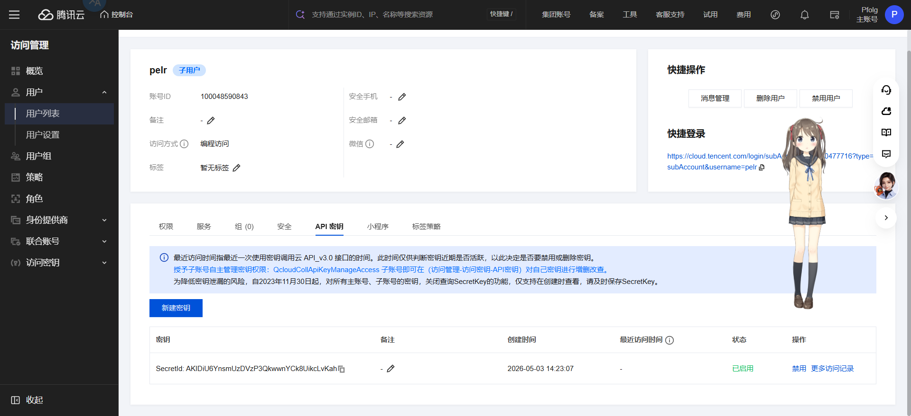
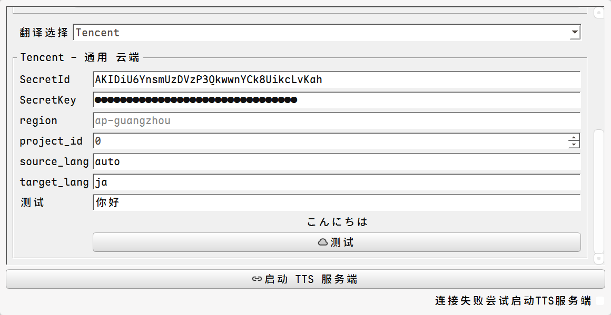

# 腾讯云翻译功能配置指南

> **适用场景**：你正在使用 Pelr 或其他接入了腾讯翻译的桌面工具，需要配置翻译功能让它正常工作。跟着本指南操作，大约 10 分钟即可完成全部设置。

---

## 一、准备工作：获取你的专属密钥

要让翻译功能正常工作，你需要先从腾讯云获取一对"钥匙"——**SecretId** 和 **SecretKey**。这就像你要用银行保险柜，银行需要先给你一把钥匙。

### 1.1 注册腾讯云账号

1. 打开 [腾讯云官网](https://cloud.tencent.com/)
2. 点击右上角 **"免费注册"**
3. 使用微信或 QQ 扫码完成注册

### 1.2 完成实名认证

1. 点击右上角头像 → **账号信息** → [实名认证](https://console.cloud.tencent.com/developer/auth)
2. 按页面指引填写身份信息（支持个人或企业认证）
3. 认证通常在几分钟内审核通过

### 1.3 开通机器翻译服务

1. 登录 [腾讯云控制台](https://console.cloud.tencent.com/)
2. 访问 [机器翻译控制台](https://console.cloud.tencent.com/tmt)
3. 勾选服务协议，点击 **"开通服务"**

> **免费额度说明**：腾讯翻译 API 每月提供 **500 万字符**的免费额度，个人日常使用完全够用，无需充值。

### 1.4 创建密钥（重要：请仔细阅读）

这一步是关键。你需要创建一个专门用于翻译的子账号，并获取它的密钥。

> ⚠️ **特别提醒**：密钥中的 `SecretKey` **只会在创建时显示一次**，关闭弹窗后永远无法再次查看。请务必在看到后立刻复制保存到安全的地方（如记事本、密码管理器）。

**操作步骤：**

**第一步：创建子用户**

1. 打开 [访问管理 - 用户列表](https://console.cloud.tencent.com/cam)
2. 点击 **"新建用户"** → **"自定义创建"**
3. 类型选择 **"可访问资源并接收消息"**，点击下一步
4. **用户名**：填写一个易记的名字，比如 `pelr-translate`
5. **勾选 "编程访问"**，点击下一步

**第二步：授权翻译权限**

1. 在策略搜索框中输入 `TMT`
2. 勾选 **`QcloudTMTFullAccess`**（机器翻译全读写权限）
3. 点击下一步，再点完成

**第三步：生成密钥**

1. 在用户列表中，点击刚才创建的 `pelr-translate` 用户名
2. 切换到 **"API 密钥"** 标签页
3. 点击 **"新建密钥"** → 系统会发送验证码到你的手机
4. 输入验证码后，页面会显示：

```
SecretId: AKIDxxxxxxxxxxxxxxxxxxxxxxxxxx
SecretKey: xxxxxxxxxxxxxxxxxxxxxxxxxxxxx
```

1. **立刻！立刻！** 将这两个值复制并粘贴到你的记事本里保存好

<details>
<summary>预览</summary>



</details>

---

## 二、在软件中配置翻译功能

拿到密钥后，回到你的桌面软件（以 Pelr 为例），打开设置面板，找到翻译相关的配置区域。

### 2.1 填写信息

在设置中找到以下配置项，对应填入刚才保存的信息：

| 你看到的设置项    | 你要填入的内容                                    |
| :---------------- | :------------------------------------------------ |
| 翻译源 / 翻译引擎 | 选择 **腾讯云** 或 **Tencent Cloud**              |
| SecretId          | 粘贴刚才保存的 SecretId（以 AKID 开头的那串）     |
| SecretKey         | 粘贴刚才保存的 SecretKey                          |
| 服务地域          | 保持默认 `ap-guangzhou`（广州）即可               |
| 目标语言          | 翻译后要得到的语言，如 `en`（英文）、`ja`（日文） |
| 源语言            | 可留空，系统会自动检测；也可手动指定              |

### 2.2 保存并检查

填写完毕后保存配置。请逐条确认：

- [ ] 翻译引擎已切换到腾讯云
- [ ] SecretId 已粘贴完整，末尾没有多余空格
- [ ] SecretKey 已粘贴完整，末尾没有多余空格
- [ ] 目标语言已正确填写（如 `en`、`ja`、`ko`）

---

## 三、测试翻译功能

配置完成后，你可以通过以下方式快速验证是否一切正常：

### 方式一：使用软件自带的测试按钮

如果软件设置界面里有 **"测试翻译"** 或类似的按钮，点击它，系统会用一条简单文本（如"你好，世界"，翻译成英文）进行测试。结果显示译文即表示配置成功。

<details>
<summary>预览</summary>



</details>

### 方式二：在正常使用中验证

直接使用翻译功能翻译一段话。如果能够正常返回译文，说明配置完全正确。

---

## 四、常见问题解决

| 你遇到的问题           | 可能的原因                      | 解决方法                                                                                                                                                                 |
| :--------------------- | :------------------------------ | :----------------------------------------------------------------------------------------------------------------------------------------------------------------------- |
| 提示"SecretId 未找到"  | SecretId 填写错误或密钥已被禁用 | 回到 [API 密钥管理](https://console.cloud.tencent.com/cam/capi) 检查密钥是否存在且状态为"启用"                                                                           |
| 翻译结果为空或没有反应 | 网络连接问题                    | 检查本机能否正常访问外网；公司网络可能有防火墙限制，尝试切换到手机热点测试                                                                                               |
| 翻译内容明显不对       | 源语言设置不正确                | 将源语言设为"自动检测"（auto），大多数情况可以正确识别                                                                                                                   |
| 不知道密钥是否正确     | 想快速单独验证                  | 点击 [API Explorer 在线调试](https://console.cloud.tencent.com/api/explorer?Product=tmt&Version=2018-03-21&Action=TextTranslate)，填好密钥和文本，点"在线调用"立即看结果 |

如果以上方法仍未解决你的问题，可以查看腾讯云翻译的错误码说明页面寻找对应的错误提示解释。

---

## 五、安全提醒

- **请勿将你的 SecretKey 分享给任何人**，否则他人可以盗用你的翻译额度。
- **请勿将含有密钥的配置文件公开发布**到网盘、论坛等公开平台。
- 如果怀疑密钥已泄露，立刻回到 [API 密钥管理](https://console.cloud.tencent.com/cam/capi) 禁用旧密钥并创建新密钥。

---

_本指南基于真实用户的成功配置经验编写。如果你在操作中遇到其他问题，欢迎反馈，我们会持续更新完善。_
