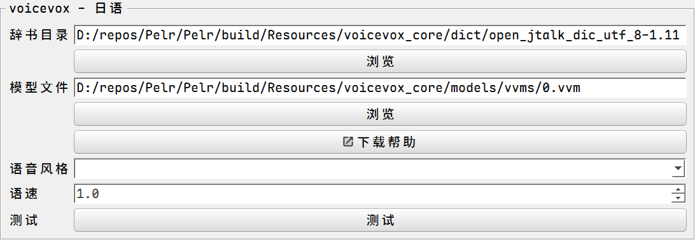

### voicevox 配置指引

注意，每个模型有其相应的利用条款，请自行查看。

本程序的日语TTS模块基于`voicevox_core c_api 0.16.4`开发

[voicevox_core](https://github.com/VOICEVOX/voicevox_core)
官网：<https://voicevox.hiroshiba.jp/>

本程序不提供voicevox_core的`辞书`和`模型`文件，需要用户按需下载。

简明配置：

前往：<https://github.com/VOICEVOX/voicevox_core/releases/tag/0.16.4>

本程序使用的是`0.16.4`版本的c_api

下载：`download-windows-x64.exe`

运行该程序后，将下载后的文件夹（约1G）放到`Resources`目录下

模型选择：<https://github.com/VOICEVOX/voicevox_vvm>

模型预览可前往官网。

或者自定义，但是要在设置中进行相应配置，不论是否将文件放到推荐目录。

设置页上如果未显示语音风格但已进行配置属于正常现象，依然可以测试成功。

典型配置：

预览

