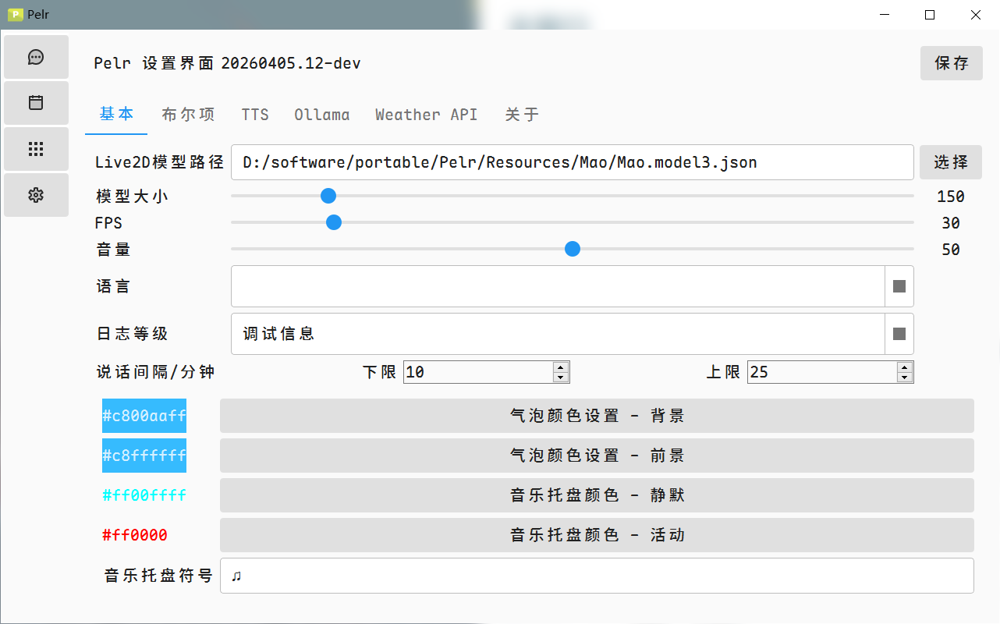
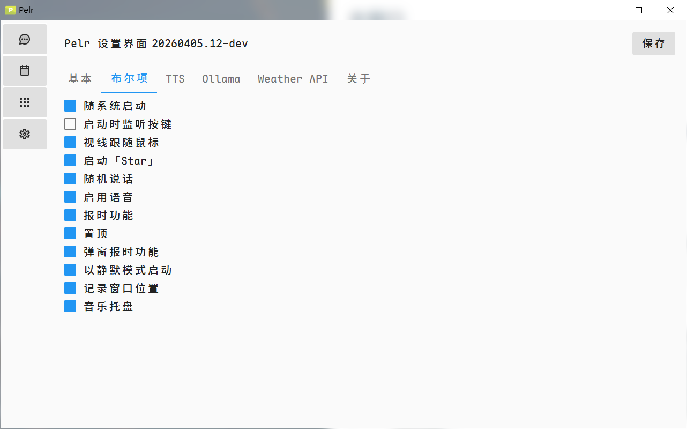
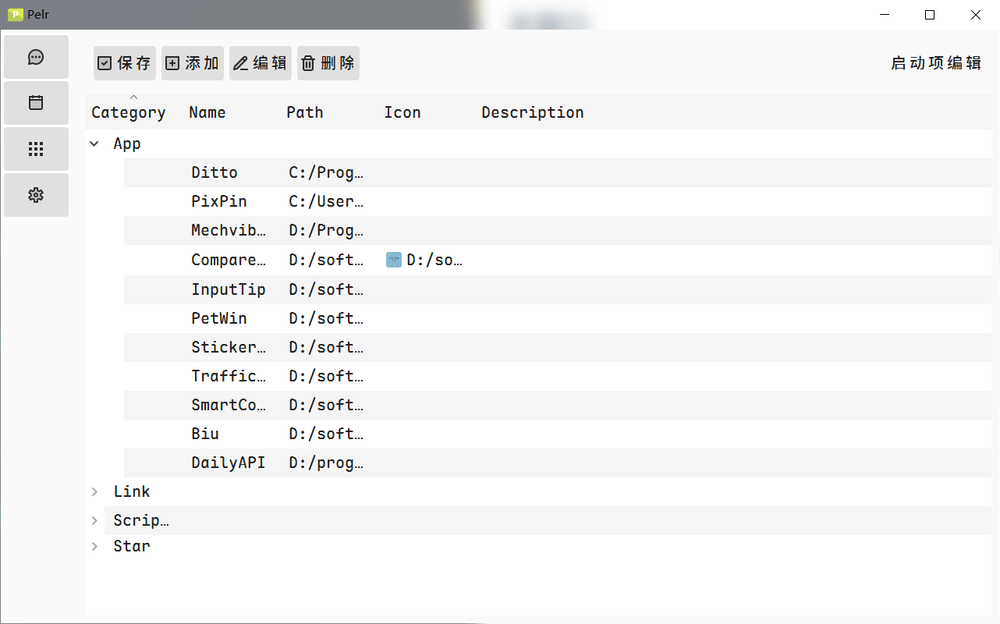
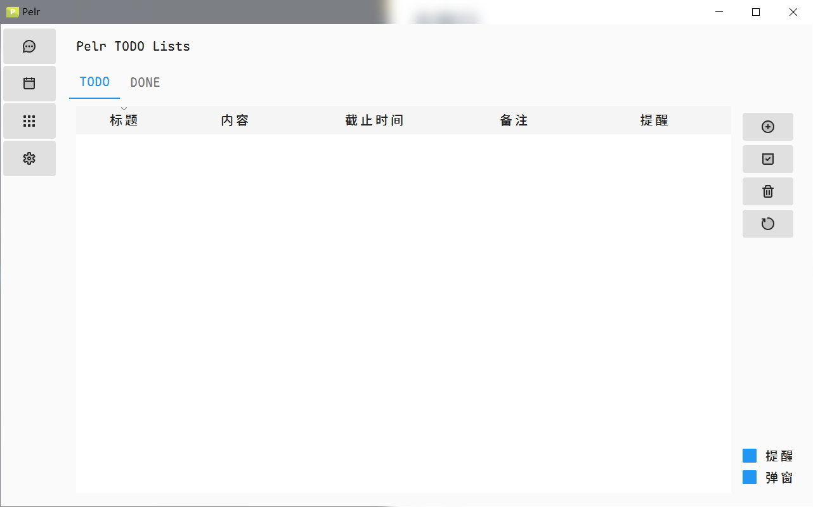
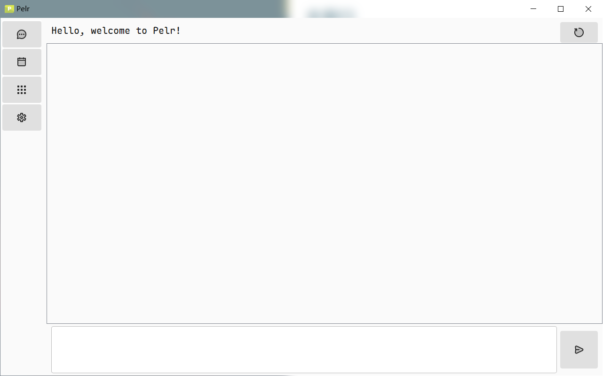

## 主窗口

主窗口包含4个子窗口

### 设置

设置界面包含了一些最基本的设置，用户可以根据自己的喜好进行调整，有相关设置无法满足的，可以提ISSUE或者自己写功能

预览

### 启动项配置

这是本软件作者用得最多的功能，可以在此设置一些链接、应用路径之类的。

目前只支持四类定义（`APP`, `Link`, `Scripts`, `Star`），不支持自定义。

其中 `Star` 类内的项目会在软件启动后一段时间（1min）运行，如果系统启动时间超过20分钟，则不会运行。

预览

### TODO

TODO窗口可以使用户设置一些简单的事项，在这里进行相关配置后，气泡可以显示提醒

预览

### AI Chat

用户可以在这个窗口与 AI 进行聊天，当然也要首先配置模型.

预览

