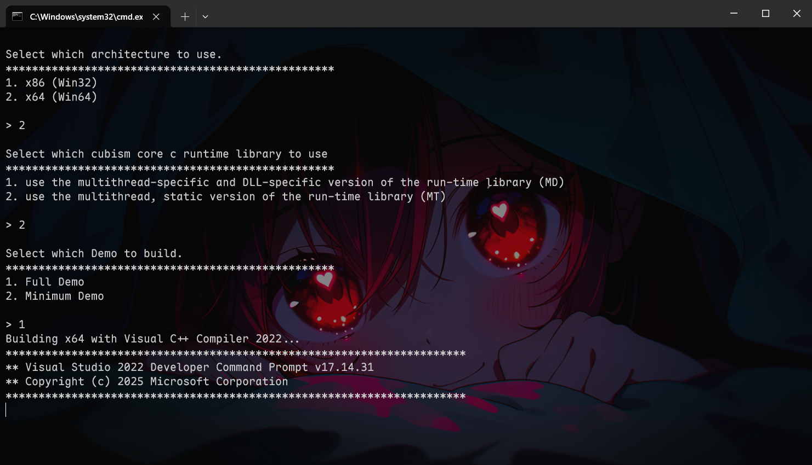
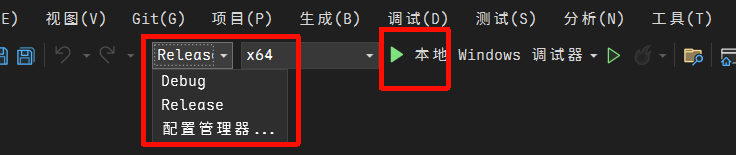
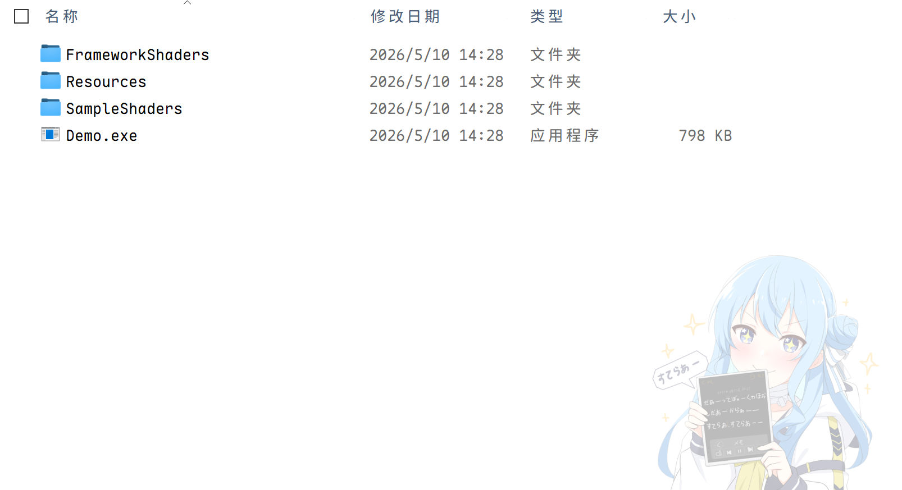
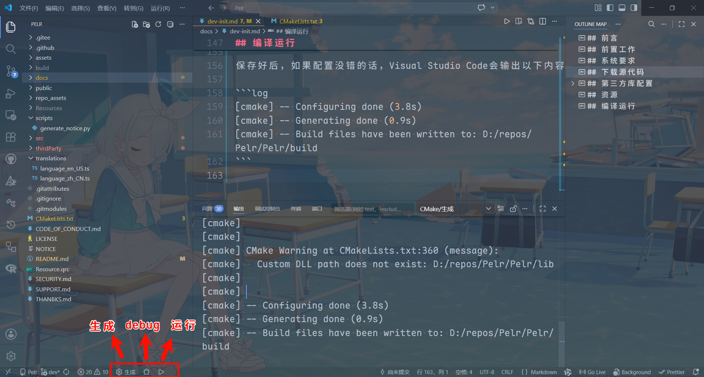
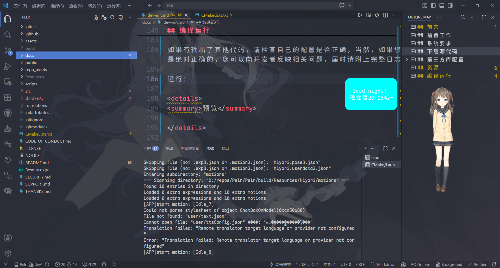

## 前言

这份文件将指导开发者或用户在 Windows10/11 系统上面进行本项目的环境构建，以及成功运行。

这是一个极其复杂的项目，在开始之前酌情选择是否要使用这个项目。当然，你编译好后所获得的喜悦也是无可替代的！

## 前置工作

- Microsoft Visual Studio 2022 (C++)
- Visual Studio Code (IDE，可以是其他，安装`CMake Tools`插件)
- Python 3.11 (可选)
- Git
- Qt 5.15.2 (Cmake)

关于这些软件的安装，您可以自行在网上搜索教程。

## 系统要求

至少保证`5G`的储存空间(本项目需要)。

约`20G`Visual Studio 2022的C++开发环境，本项目不由该IDE开发，仅需其编译输出的资源文件。

## 下载源代码

您可以采用任意方式下载本项目的源代码，包括但不限于下载仓库压缩包或者用 Git 克隆仓库。

```shell
git clone https://github.com/igugyj/Pelr.git
```

或

```shell
git clone git@github.com:igugyj/Pelr.git
```

然后进入项目目录：

```shell
git submodule update --init --recursive
```

这个命令用于添加项目所需的子模块。

---
如果您想在下载项目的时候就一步到位，可以这样：

```shell
git clone --recursive https://github.com/igugyj/Pelr.git
```

## 第三方库配置

### voicevox_core

可参考：[voicevox 配置指引](app-voicevox.md)

前往：<https://github.com/VOICEVOX/voicevox_core/releases/tag/0.16.4>

下载：`download-windows-x64.exe` 该文件运行结束后，会产生一个文件夹`voicevox_core`

如果图方便的话，可以直接把这个文件放到 `thirdParty`和`Resources`；如果储存空间比较紧张的话，建议这样：

- `thirdParty/voicevox_core/c_api`
- `thirdParty/voicevox_core/onnxruntime`
- `Resources/voicevox_core/dict`
- `Resources/voicevox_core/models`

---

### Cubism Core

根据`Live2D Proprietary Software License`，本项目不会提供该文件！

<https://www.live2d.com/zh-CHS/sdk/download/native/>

通常会尽量支持最新版本的`Cubism Core`

下载`CubismSdkForNative-5-r.5.zip`，把其`Core`文件夹放到`thirdParty`目录下。

注意不要直接剪切这个文件夹，要保留 SDK 目录的完整性。

### glew glfw stb

运行：`thirdParty/scripts/setup_glew_glfw.bat`，结果为成功时则算成功。

## 资源

`Resources`是存放资源的目录，并且在编译的时候不会把它编到程序里面，而是在结束时会把该目录下所有的内容复制到构建输出目录中。

voicevox 辞书目录
`Resources/voicevox_core/dict`

voicevox 模型目录
`Resources/voicevox_core/models`

---

获取 Live2D 资源

- `Resources/FrameworkShaders`
- `Resources/Resources`
- `Resources/SampleShaders`

进入`CubismSdkForNative-5-r.5\Samples\OpenGL`

在`scripts`目录运行这个脚本：
`CubismSdkForNative-5-r.5\Samples\OpenGL\thirdParty\scripts\setup_glew_glfw.bat`

这个脚本可以确保你这个目录里面Framework samples 所需的第三方库得到配置。

本项目 `thirdParty` 里面的脚本也是这个脚本。

---

进入`CubismSdkForNative-5-r.5\Samples\OpenGL\Demo\proj.win.cmake\scripts`

运行`proj_msvc2022.bat`，在此之前，确保你的 Visual Studio 得到配置，记得选择对应版本的 Visual Studio 脚本。

<details>
<summary>预览</summary>



</details>

进入：`CubismSdkForNative-5-r.5\Samples\OpenGL\Demo\proj.win.cmake\build\proj_msvc2022_x64_mt`

双击`Demo.sln`，打开Visual Studio。

可以直接点击运行按钮，也可以选择 release 之后再点击运行按钮。

<details>
<summary>预览</summary>



</details>

等待构建成功之后，它就会在这个目录下生成一些我们所需要的文件

进入`CubismSdkForNative-5-r.5\Samples\OpenGL\Demo\proj.win.cmake\build\proj_msvc2022_x64_mt\bin\Demo`

选择一个目录`Debug`或`Release`，没有差别
<details>
<summary>预览</summary>



</details>

复制这3个文件夹到项目`Resources`目录。

资源配置完成！

---

## 编译运行

配置`CMakeLists.txt`，确保你的 QT mingw 是你电脑上所有的目录

```txt
# Qt 路径与模块查找
set(CMAKE_PREFIX_PATH "D:/Qt/5.15.2/mingw81_64")
```

保存好后，如果配置没错的话，Visual Studio Code会输出以下内容：

```log
[cmake] -- Configuring done (3.8s)
[cmake] -- Generating done (0.9s)
[cmake] -- Build files have been written to: D:/repos/Pelr/Pelr/build
```

<details>
<summary>预览</summary>



</details>

点击生成可以编译项目（通常需要等待一段时间），点击运行，可以运行编译好的项目。

```log
[build] Copying Resources/voicevox_core -> output directory
[build] [100%] Built target Pelr
[driver] 生成完毕: 00:02:56.292
[build] 生成已完成，退出代码为 0
```

当退出代码显示为零时说明项目编译完毕，可以运行。

如果有输出了其他代码，请检查自己的配置是否正确，当然，如果您配置真的是绝对正确的，您可以向开发者反映相关问题，届时请附上完整日志

运行：

<details>
<summary>预览</summary>



</details>

> 基于 `20260503.14` 编写。
