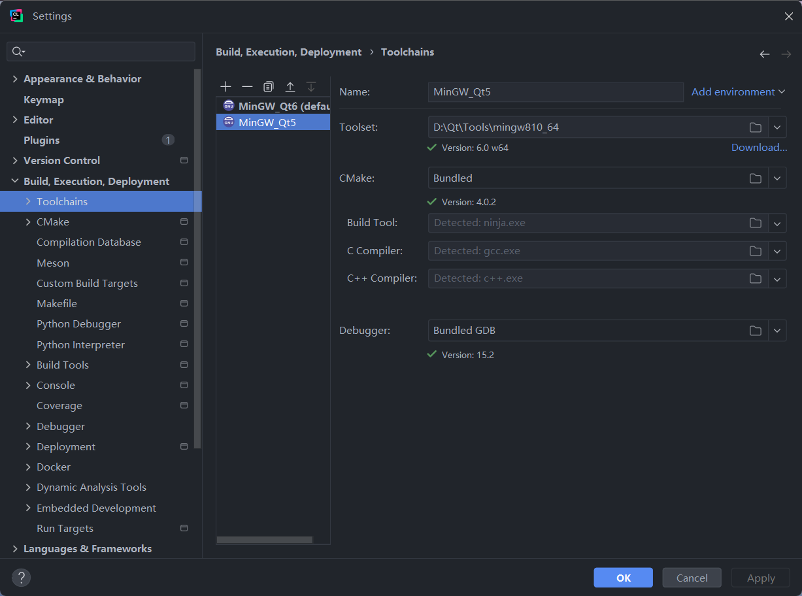
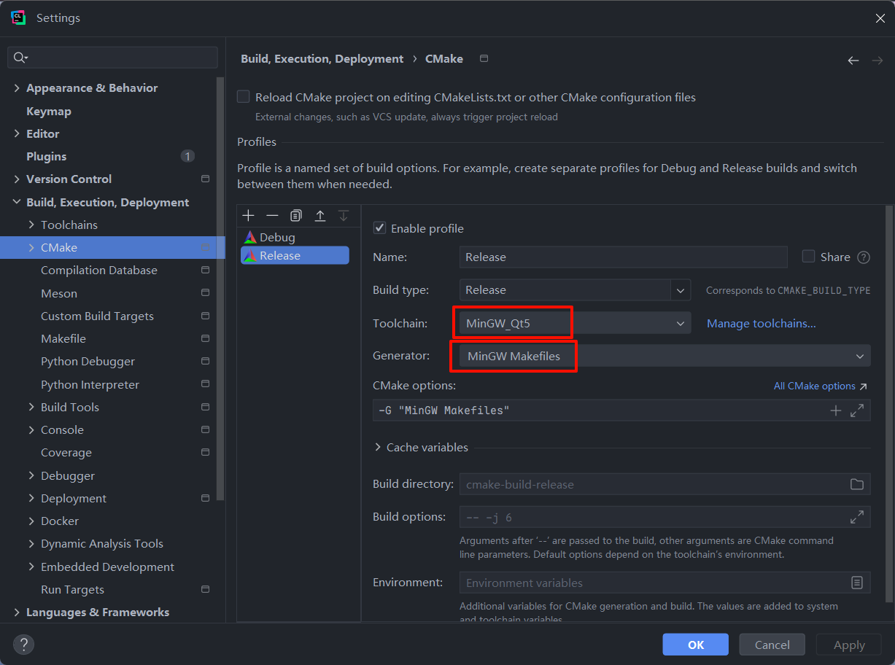
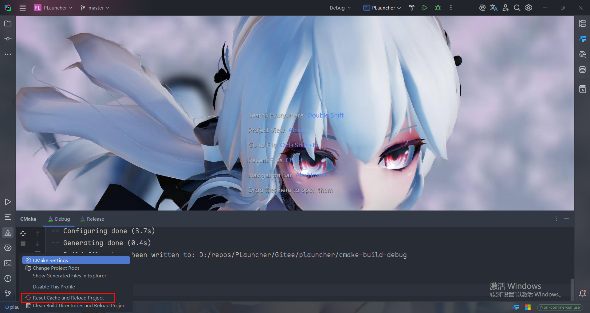
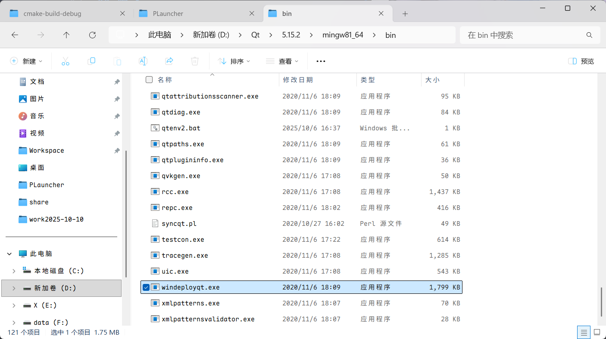

这份文件将指导用户在Clion上进行打包操作

## 编译前准备

请使用如下版本的mingw:



请配置cmake编译选项：



---
配置`CMakeLists.txt`文件，确保：

```txt
# ------------------
# 设置是否为debug模式
set(D_OR_R OFF)#ON for Debug, OFF for Release

# 是否开启控制台调试输出
set(CONSOLE OFF)
# ------------------
```

编辑`src\sources\main.cpp`，确保：

```cpp
int main(int argc, char *argv[])
{
    ...
    // 安装自定义消息处理器
    qInstallMessageHandler(messageHandler);
    ...
}
```

以便将控制台输出到日志文件

## 编译

清理缓存，如有需要，可提前删除`cmake-build-release`等类似目录



点击编译按钮，等待编译完成

## 依赖配置

### Qt依赖

复制`windeployqt.exe`的路径，并在`cmake-build-release`内打开终端执行命令：

```
"path\to\your\windeployqt.exe" PLauncher.exe
```



### 其他库依赖

进入`lib\Debug`，复制其中所有的`*.dll`文件到`cmake-build-release`目录下

## 资源

执行：

```shell
xcopy FrameworkShaders cmake-build-release\FrameworkShaders /E/H/C/I
xcopy Resources cmake-build-release\Resources /E/H/C/I
xcopy SampleShaders cmake-build-release\SampleShaders /E/H/C/I
xcopy assets cmake-build-release\assets /E/H/C/I
```

将python构建的`tts_server.exe`复制到`cmake-build-release`目录下

---
以上，基本资源配置完成，未来可能会写一个构建脚本来自动化这一流程。